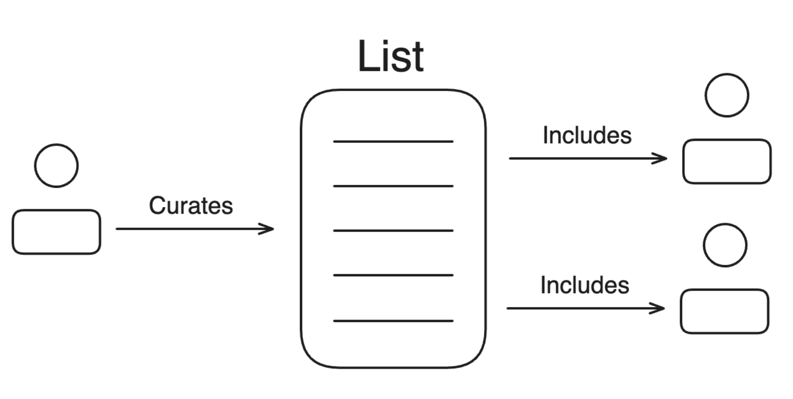
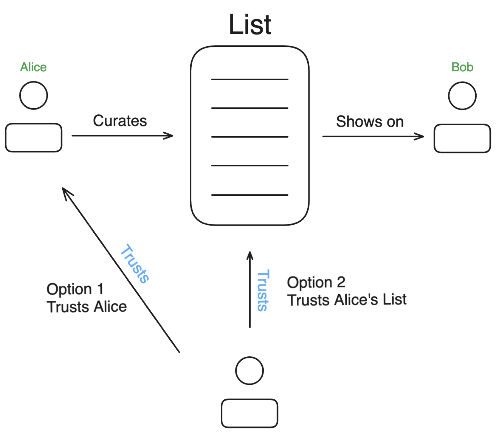
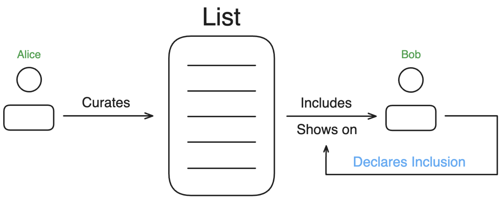
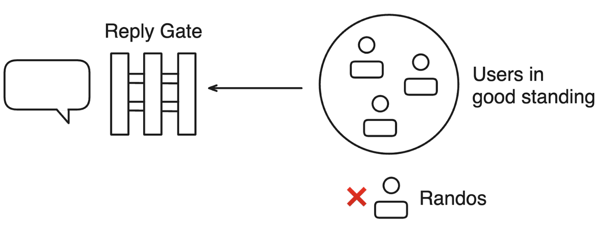

# 0001 User Lists, Reply-Gating, and Thread Moderation

Once Bluesky is open to everyone, how will communities maintain their spaces?

The influx of users will change the dynamics of the network. We’re going to need to make tools that are effective, easy to use, and can evolve over time. In that spirit, we’re presenting this set of proposals for community management..

_If you want to give feedback on this proposal, please file an issue._

# User Lists

What’s good about Lists is how simple and versatile they are. While the basic idea is straightforward – people create Lists and add members – that idea can get extended into more sophisticated systems over time.

## Use-cases for Lists

Lists are commonly used to create custom feeds. While that’s useful, we think there are some additional use-cases that we can take advantage of.

### Feed generation

Lists can be used to drive post feeds. You create a list, then create a feed from the List showing the members’ posts. Using the custom algorithms, this can actually get much more sophisticated. For instance, the List can be used as a starting point for traversing the social graph, choosing more authors to include in the feed based on their follows. Custom algorithms can also merge multiple Lists together, or use the likes of the List members to choose posts.

### Community & reputation

Lists can be used to show social relationships between users. A List can indicate involvement in an organization or membership in a specific community. They could also be used as a form of vouching system. In some cases, Lists could be used to drive permissions for a connected service (e.g. “who is an admin of this service?”). For these ideas to work as well as possible, we’ll need to consider adding some additional features to Lists like the ability for users to join & leave them or the ability to display list membership on your profile; see some of the proposals below for more.

### Moderation

Lists are a way for users to create communities within the public network. These communities can be expressed both in the positive sense (these are the people I include) and the negative sense (these are the people I exclude). We’ve already used Lists for muting, but we think they can potentially be used much more extensively to control who is allowed to interact with you. For more information, see the Reply-Gating proposal.

## The social models of Lists

The basic behavior of a List is one-way. A user creates a list and then adds or removes members.

Because it’s a one-way operation, we have to be mindful of how we treat list membership. We shouldn’t necessarily show all the lists somebody is added to because they won’t always be nice or useful.

What’s interesting is how we can potentially elaborate on this social model to add more features. Here is a selection of ideas that we think are worth looking at.

### Proposal: Trusted Lists

Lists can be very useful for reputation. For instance, it could be really useful to be able to see that your friend Alice has Bob – a stranger to you – in her “Cool Friends” list. The only reason we can’t do that by default is that the list memberships will get noisy fast.

If we could opt into trusting Alice or her specific list however, we could show that list membership on Bob’s profile.

 
The trust signal could be some specific action (“trust Alice’s lists”) or it could just be a follow. With these trusted lists visible on profiles that you visit, you can quickly discover a user’s reputation in your network.

The potential downside of Trusted Lists is that they could get catty real fast. There’s a strong appeal to walking through the entire network and declaring who is Good and who is Bad. If the net effect is to increase drama, we should be careful about this proposal.

### Proposal: Declared Memberships

Sometimes users may want to declare their inclusion in a List. This is kind of like Trusted Lists, but instead of the reader deciding which List to show on a profile, the user decides which to show.

This solves the drama problem of Trusted Lists by giving users control of which Lists show on their profile. If people keep adding you to a “Loser” list you can choose whether to put that on your profile or not.

The other interesting thing about Declared Memberships is that it verifies the social relationship. It’s one thing for Bob to put Alice on his _Wife_ List. It’s something else entirely for Alice to confirm that she belongs on the _Wife_ List.

If this concept moves forward, it may be generally useful to show the verification-by-declaration in a List’s members view. In some cases, like the _Wife_ example, it might be funny to have undeclared members but not particularly useful. It might be necessary for Lists to have an option to only show members who have confirmed membership.

Some ways Declared Memberships can be used:

* As the basis for communities which the members can functionally leave by deleting their Declared Membership.
* As a way to show social relationships such as membership in an organization, employment at a company, or Top 8 Friend status.
* As the foundation for an identity verification system.

While Declared Memberships do add some complexity to the network, we’re not aware of any clear UX drawbacks in the same way that Trusted Lists have, so they seem like a very useful option to explore.

One technical challenge will be that Declared Memberships must be verified bidirectionally before they can be shown, to make sure that people aren’t lying about the lists they’re in. Another possible concern is that showing membership in a list might need to be seen differently than “formally accepting membership” and we should be watching for whether that distinction is necessary.

### Proposal: Membership APIs

Lists are curated by the owner of the List. This means they don’t function particularly well at scale, because the owner has to manually add each member.

Where this could get more interesting is if we add support for Lists to have Membership APIs. An “API” is just a way for apps to do things. In this case, each of these APIs would add buttons and flows to the client when enabled.

Some interesting examples of what the Membership APIs could involve:

* **Join Requests.** A list could have a “Join” button which requests inclusion by a user. This could be configured to require approval, an invite code, or just automatically approve. An approved join could also automatically produce a Declared Membership, if that proposal gets implemented.
* **Leave Requests**. A list could have a “Leave” button which requests exclusion by a user. This makes obvious sense if a Join Request is supported, but it could also be used by itself to give users a way to opt out of a List.
* **Delegated Admin**. A set of APIs for giving other users admin control over a List could help scale their management and reduce the workload for the List owner.

With Membership APIs it starts to be clear how Lists could be extended into large scale communities, making Lists a very compelling tool for other systems (like algos and moderation).

Because these are APIs, it will be possible to write services that add even more behaviors like automatically approving a Join Requests if the user is followed by enough existing users. The one thing that’s kind of tricky is creating “dynamic Lists” because membership has to be published on the network, but it’s certainly possible to create a program that autonomously adds and removes users.

# Reply-Gating

Reply-Gating is a way to establish who is allowed to reply to your posts. A common example of this is “Only people I follow.”

Reply Gates can be expressed in both the positive and negative. They can be set as “Only X users can reply,” or they can be set as “Only Y users can’t reply.” It may also be possible to combine them; for instance “X users can reply but Y users can’t.”

For Reply-Gating to work, it can’t harm the serendipity of the network. You can’t be worried that you’re missing out on conversations because you set the Gate too restrictively. People need to feel confident that by setting the Gate they’re getting a strictly better experience than if they hadn’t.

The User List proposals above – especially the Membership APIs proposal – are intended to help accomplish this. With the ability to create Lists which users can join, leave, and moderate, there’s an opportunity to form large-scale communities which are actively curated. Shared membership in a List can act as a form of community reputation, ensuring that you’re only interacting with people who uphold the norms of that community.

### Changing the Reply-Gate

It’s worth noting that due to technical constraints, if a post’s reply-gate ever changes then it will likely apply retroactively. This means that posts created by somebody who is subsequently removed from the “Allow” list will be removed. In some cases this might be the desired outcome; in others it might not.

### Relationship to Blocking

Blocking mutes all interactions for the blocker and the blockee, and also prevents most forms of interaction. Therefore it’s more impactful than Reply-Gating, as it both prevents the blocked user from seeing your activity and stops quote posts as well. There are some interesting ideas to pursue around this. 

One of the technical challenges the protocol faces is that blocks are public. This is not always ideal, and so there’s some hope that Reply-Gating could reduce the need for blocking by expressing “who can reply” rather than expressing “who can’t.”

It’s also possible that Reply-Gating could generalize to Interaction-Gating; that is, to include all interactions including mentions, quote-posts, and (in the future) direct messaging. It’s not yet clear whether there are technical blockers to this, and for mentions and DMs the settings would need to be expressed at the account level instead of per-post.

## Thread Moderation

While Lists and Reply-Gating are a good way to reduce the chances of a bad interaction, they can’t fully prevent them. There are times when things can go sideways, even among trusted friends.

Thread Moderation is a proposal to give each poster localized control over their replies. For each thread, the original poster – the person who created the thread – would be given the ability to manage the discourse. In a way, this concept sees each user’s thread as a forum they’re hosting, which makes sense to us because each reply is being platformed by the visibility that the OP gains. While it may give posters the ability to hide criticisms, our feeling is that adversarial discourse is a much more pressing concern, and that criticisms have a habit of gaining visibility outside of threads just as easily.

### Proposal: Reply Deletion

The simplest action in Thread Moderation is the ability to delete a reply by other users. The deleted replies will technically still exist as users can’t control each others’ data in an open network – and therefore could be found in their profile’s “Posts & replies” – but they’ll be filtered entirely from the thread by well-behaving services (much like with Blocking).

### Alternate Proposal: Reply Hiding

Reply Hiding allows the thread creator the ability to hide any individual reply to a thread. Well-behaved clients will not display hidden replies (or their descendants) by default. Hidden replies should be sorted to the bottom of all replies and revealed only when explicitly requested (e.g. when a user presses a “Show hidden replies” button).

### Proposal: Thread Locks

Thread Locks prevent new replies from being added to a thread. They’re a simple way to cool down discourse that has gotten too heated, and they can be applied temporarily or permanently.

For technical reasons, it may be hard to enforce thread locks in the open network as it’s not always clear whether a reply was created during a Lock period. Therefore a Thread Lock may need to be purely advisory – well-behaving clients would respect the Lock by disallowing replies in the UI, but the network would be unable to reliably filter out posts created during a Lock. This issue could be mitigated by manually deleting replies that violate the Lock or by updating the Reply Gate to exclude a user that’s violating the Lock.

# Summary

These proposals are the first half of a set of moderation concepts the team is working on. There is a second set of proposals related to “labeling services” which are forthcoming.

All of these proposals are still subject to some technical challenges. The concept of “Block Lists,” for instance, have been held up for weeks due to some unsolved concerns about fan-out costs. We’re sharing these proposals with perhaps 75% confidence that those technical challenges will be solvable. If we find that is not the case, we will share more about the issues and look for alternative solutions.

_If you want to give feedback on this proposal, please file an issue._
