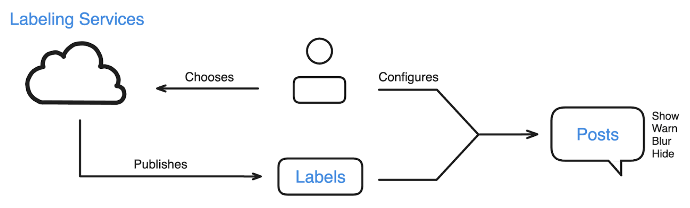

# 0002 Labeling and Moderation Controls

There’s a two-sided challenge to moderating social media. On one side you have people misbehaving at such a large scale that it’s hard to cover. On the other side you have a wide variety of preferences that affect what a good experience looks like in a very personal way. We have to find a solution to both of these needs.

This proposal addresses what we typically understand as “moderation.” It is designed for an open network and includes some unique ideas, including the ability to configure moderation and for those chosen moderators to apply more subjective decisions than usual.

_If you want to give feedback on this proposal, please file an issue._

# What are labels?

“Labels” are tags that get attached to posts and users. They’re used to drive moderation.

Some examples of labels already in use:

* **nudity**. The post contains visual non-sexual nudity.
* **self-harm.** The post contains images or discussion of self-harm.
* **spam**. The account is engaging in excessive, unwanted interactions.
* **impersonation**. The account is claiming to be somebody they’re not.

Labels are created by Labeling Services who publish the labels on the network. Users then choose their Labeling Services and how to interpret the labels. These combine to show, blur, hide, or attach a warning to content.

Users can have more than one Labeling Service, with a default given by your server and possibly more suggested as options. Labeling Services can be used by any user and can cover the entire network so it’s not solely the job of a server admin to moderate their space.

To reiterate:

* Users choose Labeling Services.
* Labeling Services create Labels on posts and accounts from anywhere in the network.
* Users decide how to interpret Labels from each service to either hide, warn, blur, or show content.

# Labeling Services

Labeling Services publish labels on the network. Anyone can create a Labeling Service, and any user can choose which Labeling Services they use. Applications ignore (and not even visually display) labels from services which the user does not subscribe to.

To control a Labeling Service, the Bluesky team has created an application that’s codenamed Redsky. Redsky includes tools for viewing accounts, posts, and reports submitted by users. An admin can use it to apply labels and, if attached to a hosting service, take down accounts. It is also possible to use automated labelers to detect some kinds of content, as Bluesky does now. We are currently working to release Redsky (likely under another name) so that folks can run their own labeling services.

Labeling Services declare which labels they publish along with a policy document so that users know what to expect and how to configure their applications. Running a Labeling Service will require some technical know-how, much like running Custom Feeds does now. Depending on the demand, we may look for ways to make them easier to run.

The term “Labeling Service” is a bit technical and we should look for a better name in the interface. Some candidates are _Labeler_, _Moderator_,_Moderation Authority_, and _Moderation Service_.

## Reporting content

Users can report content and accounts that they think violate some policy. The report includes policy they feel was violated the label or the label “category” that they believe should be applied and an optional description field. Reports are sent to the user’s saved Labeling Services.

Labeling Services review and act on reports at their own discretion. They may choose to only accept reports from a specific set of users, and they may choose to ignore reports from any user that abuses the system.

## Self-labeling

In some cases, it makes sense for users to self-label their accounts or content (often referred to as a “Content Warning” in other apps). This is a frequent request among creators of mature content, and it will also be useful for cases such as spoilers.

Because labels are a universal system on the AT Protocol, a generic “$labels” field will be added to Lexicon which accepts a list of labels that the user wants to declare. To label their entire account, a user will set the field on their profile.

By default, accounts have labeling authority over their own content, and this should be respected by default. We currently believe that an incorrect self-label can’t cause too much harm because additional labels can be applied, and the more strictly-interpreted label will always apply.

## Custom Labeling Services

Much like Custom Feeds, a Labeling Service just needs to satisfy a set of APIs in order to work with the network. This means there are multiple ways they can be implemented.

The Labeling Service software that Bluesky has developed operates by a traditional flow: users submit reports and then moderators resolve the reports by creating a label, issuing a takedown, or simply ignoring it. There is also an auto-labeler for detecting certain kinds of content (such as pornography).

However, it’s possible to create alternative approaches which are more community-driven. For example a Custom Labeling Service could instead designate a set of users who are able to create labels automatically though an in-app action. The logic could get more sophisticated: for instance, the label could apply after 3 members of a community say so, and could be removed if 5 members of a community disagree. These rules can be customized in a variety of ways.

To fully enable this, we need to wrap our heads around the protocol for interacting with Labeling Services from within the app. Currently users are only able to send reports and there’s no way of knowing that a user is an admin. We’re keen to work with developers to elaborate on this protocol so that more behaviors can be created!

## Technical aside: how labels are published

Unlike most content on the AT Protocol, Labeling Services do not host their labels in a repository. This is because the volume of Labels is too high to fit economically into data repositories.

Instead, labels are published using a specific set of APIs which are optimized for streaming and fetching the content. These labels are ingested by various providers and attached to content when they are sent down to the app.

# The vocabulary of labels

It’s important to make sure that labels are well-defined so that everybody understands what they’re talking about. There will always be room for interpretation, but what we don’t want is confusion.

The following is one of the weirder lists we’ve ever assembled. As we consider these labels, please remember that everybody is engaging in good faith and trying to create something useful. If you have concerns or suggestions please share them – we’re interested in hearing it! – but please know we’re not trying to make anyone uncomfortable.

While reviewing these labels, remember that their application is subjective, that Labeling Services will declare which labels they will apply, that multiple labels can be applied on a post, and that servers are still able to take down content at their discretion. It’s also important to remember that labels will have different defaults and preferred behavior; some are designed to hide, others to warn and blur, and some others to show by default.

### Mandatory

Mandatory labels cannot be configured. See “Moderation that’s not subject to choice” below for more information.

* **csam**. Child sexual assault material.
* **nudity-nonconsensual**. Nudity or sexual material which has been identified as being shared without the consent of the subjects.
* **dmca-violation**. The content has received a DMCA takedown request.
* **doxxing**. Information that reveals private information about someone which has been shared without the consent of the subject.

### Adult Content

Content which is sexual in nature. These designations are sometimes controversial – views around artwork and nudity often vary. This may need to be solved with more fine-grained Labels, or it may be solved by using Labeling Services which reflect each users’ views more accurately.

* **porn**. Images of full-frontal nudity (genitalia) in any sexualized context, or explicit sexual activity (meaning contact with genitalia or breasts) even if partially covered. Includes graphic sexual cartoons (often jokes/memes).
* **sexual**. Content that does not meet the level of “pornography”, but is still sexual. Some common examples have been selfies and “hornyposting” with underwear on, or partially naked (naked but covered, eg with hands or from side perspective). Sheer/see-through nipples may end up in this category. 
* **nudity**. Nudity which is not sexual, or that is primarily “artistic” in nature. For example: breastfeeding; classic art paintings and sculptures; newspaper images with some nudity; fashion modeling. “Erotic photography” is likely to end up in sexual or porn.

### Violent

Content which is violent or deeply disturbing by nature.

* **nsfl**. “Not Suitable For Life.” This label covers graphic visual images like the infamous “goatse” (don’t look it up).
* **corpse**. Visual image of a dead human body in any context. Includes war images, hanging, funeral caskets. Does not include all figurative cases (cartoons), but can include realistic figurative images or renderings. 
* **gore**. Intended for shocking visual images, typically involving blood or visible wounds.
* **torture**. Depictions of torture of a human or animal (animal cruelty).
* **self-harm**. A visual depiction (photo or figurative) of cutting, suicide, or similar.

### Intolerant

Content or behavior which is hateful or intolerant toward a group of people.

* **intolerant-race**. Hateful or intolerant content related to race.
* **intolerant-gender**. Hateful or intolerant content related to gender or gender identity.
* **intolerant-sexual-orientation**. Hateful or intolerant content related to sexual preferences. \
**intolerant-religion**. Hateful or intolerant content related to religious views or practices.
* **intolerant**. A catchall for hateful or intolerant content which is not covered by the above Labels.
* **Icon-intolerant:** Visual imagery associated with a hate group, such as the KKK or Nazi, in any context (supportive, critical, documentary, etc)

### Rude

Content or behavior which is rude toward users. Many of these labels are subjective and can have overlapping meanings, so it is at the discretion of the Labelers to choose which apply correctly. (Multiple labels can be applied if needed, and where appropriate these labels can be applied to an entire account.)

* **trolling**. Content which is intended to produce a negative reaction from other users.
* **harassment**. Repeated posts directed at a user or a group of users with the intent to produce a negative reaction.
* **bullying**. Statements or imagery published with the intent to bully, humiliate, or degrade.
* **threat**. Statements or imagery published with the intent to threaten, intimidate, or harm.
* **baiting**. Similar to trolling, content which is intended to produce a negative reaction but expressed with a veneer of neutrality.

### Unpleasant

A highly subjective category which is geared towards curating a more positive environment. These labels do not always imply that the author has done something wrong. They are instead intended to give users an opportunity to choose the experience they want.

While other Labeling Services can incorporate these labels, Bluesky’s own Labeling Service is unlikely to apply many of these.

* **disgusting.** Content which is gross, like an image of poop.
* **upsetting**. Content which is upsetting, like a video of an accident.
* **profane**. Content which includes excessive swearing or violates common sensibilities.
* **partisan**. Anything that discusses politics or political discourse.
* **troubling**. Content which can be difficult to process such as bad news.
* **shaming**. Negative conversations about someone’s behavior.
* **negative**. Statements which are critical, pessimistic, or generally negative.
* **spicy**. Provocative statements.
* **bad-take**. A comment that doesn’t really land and is likely to just produce arguments.
* **arguing**. A conversation that’s more argumentative than informative.
* **tiresome**. Drama, discourse.
* **gate-keeping**. Statements geared toward establishing an in-group and an out-group.
* **concern-trolling**. Statements which are ostensibly expressing concern or sympathy but seem designed to create problems.
* **clout-chasing**. Statements which are designed to elevate the author’s profile.

### Spam

Spam covers content that doesn’t add to the conversation.

* **spam**. Repeat, low-quality messages which are clearly not designed to add to a conversation or space.
* **clickbait**. Low-quality content that’s designed to get users to open an external link by appearing more engaging than it is.
* **shill**. Over-enthusiastic promotion of a technology, product, or service, especially when there is a financial conflict of interest.
* **promotion**. Advertising or blunt marketing of a commercial service or product.

### Misinformation

This category is geared towards producing a healthier information network. These labels can be quickly politicized and need to be used with some care.

* **account-security**. Content designed to hijack user accounts such as a phishing attack.
* **net-abuse**. Content designed to attack network systems such as denial-of-service attacks.
* **impersonation**. Accounts which falsely assert some identity.
* **scam**. Fraudulent content.
* **misinformation**. Lies.
* **misleading**. For example, “rick roll” links. Not to be used for misinformation, fraud, or scams.
* **unverified**. Assertions which have not been verified by a trusted source.
* **manipulated**. Content which misrepresents a person or event by modifying the source material.
* **fringe**. Conspiracy theories.
* **bullshit**. Content which is not technically wrong or lying, but misleading through omission or re-contextualization.

### Spoilers

We couldn’t figure out which category this fits into.

* **spoiler**. Discussion about film, TV, etc which gives away plot points.

## Imperative labels

In addition to the vocabulary above, there are three labels that have special powers:

* **!blur**. Account or content will be put behind a generic warning.
* **!filter**. Account or content will be removed from view.
* **!no-promote**. Account or content will not be placed in algorithmic feeds.

These labels act as a kind of emergency override for scenarios where none of the existing labels will do the job. While only applied when coming from a Labeling Service that the account has subscribed to, the specific behavior can not be configured by the client, and they should be used with care.

## About neutral and positive labels

Most of the proposed labels cover negative behaviors. This is because they are primarily designed for filtering. However some labels are neutral, such as “spoilers,” “political,” and all of the mature content labels.

It is possible that more neutral labels would be useful for filtering. For instance, it might be worth considering labels like “humor” or “satire” which add context and can help keep jokes out of spaces which are intended to be serious.

This also opens some questions about how effective labels are compared to other systems. Would it be useful, for instance, to try to create labels for every possible topic (i.e. “sports,” “tech,” etc?). Adding labels is likely to take time and it may never be possible to produce a wide enough topics vocabulary to be useful, but it’s not unthinkable to try. This may be an area where Hashtags are more suitable.

Another angle to consider is positive labels, such as “best-of”, “uplifting”, or “funny.” Doing so would expand labeling out of moderation and into curation; ostensibly the goal of positive labels would be to drive feeds. We’re certainly open to considering this.

# Moderation Controls

To tie this all together, let’s look at the configuration interface that the app should use.

Broadly speaking, the user needs to configure each label from each source:

> “The ___ label from ___’s Labeling Servicer should do ___ .“

So, for instance, “the gore label from Bluesky’s Labeling Service should hide the post.”

There are a lot of labels and a lot of potential actions. Our challenge is to make an interface that’s easy to use but still offers a lot of tweaking power.

## Choosing Labeling Services

Like with Custom Feeds, it should be possible to publish the existence of Labeling Services so that users can discover them and save them to their active labelers. The configuration screen should show the saved labelers and give a fast action to enable or disable them.

## The possible actions on a label

There are five possible interpretations for a label:

* **Hide**. Filter the content out of feeds, notifications, and threads; blur the content if opened directly.
* **Reduce**. Filter the content out of feeds and blur the content in all other contexts.
* **Warn**. Put the content behind a cover that requires a click-through. Depending on the label, the blur should cover the entire post, the content of the post, or just the media of a post.
* **Advise**. Attach a warning label to the content but don’t filter or blur it.
* **Show**. Ignore the label.

These settings are applied globally. It might be possible to have local overrides (such as settings for a specific feed or a specific labeler) but we want to keep things simple for now.

## Grouping labels together

To help simplify configuration, labels can be grouped together in clients to cover them broadly. This can be done by label categories (i.e. “Mature Content” and “Violence”) or by some other grouping. The groupings can be expanded to give more fine-grained control, if the user wants.

## Saved Configurations

Label configurations can be saved as in collections (which will require some term to define them). The user’s saved configurations will be listed in an easy-access control so they can quickly swap between them. Some example configurations might be “Safe for Work,” “Calm,” or “Spicy.” This makes it easy to set the experience you’re looking for.

Configurations can be expanded to cover more than labels, as needed. Applications should also try to include some default Vibes which the users can then tune and save.

## Evolving over time

As label interpretations are controlled entirely by applications, there’s a lot of freedom among app developers to improve on these controls. We should continue to look for ways to make the Vibe Controls as simple and useful as possible.

# Moderation that’s not subject to choice

Some labels can not be overridden by users. These include labels that cover legal concerns such as child sexual assault material (CSAM) and non-consensual nudity.

Servers and infrastructure have discretion over what they host. A server admin can choose to take down a post by their users and infrastructure providers can choose not to rebroadcast information. On Bluesky services we try not to do this often, but we will if we have to. The reason there are Labels for things like CSAM is to help other providers act quickly on the content. This is extremely sensitive, however, and we’re evolving the tooling to ensure we’re never helping such content spread.

Another strict requirement that we have to observe is various App Store rules. Apple’s rules, for instance, mandate that mature content cannot be enabled except through a website. If we want to have an iOS app then we have to abide by their rules, so mature content labels can only be modified according to their rules on iOS.

# Summary

This proposal is dense but it’s important. The way we solve these problems is the difference between a truly great and a truly terrible social network. We hope this proposal sets a solid foundation for Bluesky and the wonderful community that’s evolving on the network. Please, don’t hesitate to share your feedback.

_If you want to give feedback on this proposal, please file an issue._
