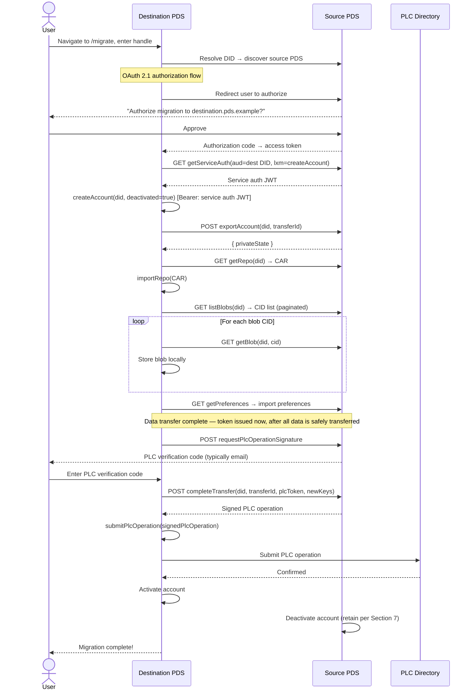

0014: PDS-to-PDS Repository Migration
=====================================

> *Author: Clinton Bowen · Date: 2026-03-20 · Epistemic status: Early draft / community proposal, not yet adopted by the protocol team · Discussion: https://discourse.atprotocol.community/t/proposal-0014-pds-to-pds-repository-migration/686*

## Summary

This proposal introduces a destination PDS initiated account (repo) migration protocol for AT Protocol. The aim is for a user to initiate account migration at the PDS they want to migrate to.  The proposal presents both a web UI flow and a corresponding XRPC based API, authorizes access to their source PDS via OAuth, and the destination PDS pulls account data directly using existing ATProto sync endpoints (`getRepo`, `listBlobs`, `getBlob`, `getPreferences`). Two new XRPC endpoints (`exportAccount` for private state transfer, `completeTransfer` for PLC operation signing) and an optional `getTransferStatus` polling endpoint replace the current client-orchestrated migration model with a direct, server-to-server transfer.

## Motivation

Account portability is fundamental for the decentralized architecture of AT Protocol and conforms to the AT Protocol [ethos][atproto-ethos].

The current migration architecture, while functional, has a less than desirable user experience.

### Current Migration Flow

Today, account migration typically follows a documented [migration flow][newbold-migration] that consists of a client, two PDS instances, and the PLC directory. The flow proceeds through four phases:

1. **Account creation**: The client obtains a service auth JWT from the old PDS (`com.atproto.server.getServiceAuth`), then creates a deactivated account on the new PDS (`com.atproto.server.createAccount`) using its existing DID.

2. **Data transfer**: The client downloads the full repository as a CAR file (`com.atproto.sync.getRepo`), uploads it to the new PDS (`com.atproto.repo.importRepo`), then enumerates all blobs (`com.atproto.sync.listBlobs` / `com.atproto.repo.listMissingBlobs`) and re-uploads them one at a time (`com.atproto.sync.getBlob` → `com.atproto.repo.uploadBlob`).

3. **Identity update**: The client requests a PLC operation signature token via email (`com.atproto.identity.requestPlcOperationSignature`), constructs and signs a PLC operation to update the DID document (`com.atproto.identity.signPlcOperation`), and submits it to the new PDS (`com.atproto.identity.submitPlcOperation`).

4. **Activation**: The client activates the new account (`com.atproto.server.activateAccount`) and deactivates the old one (`com.atproto.server.deactivateAccount`).

### Documented Pain Points

**Sequential blob transfer is the primary bottleneck.** Repo migrators today require a user to download every blob from the old PDS and reupload to the new PDS individually. The Bluesky PDS `uploadBlob` implementation enforces a rate limit of [1,000 uploads per day][uploadblob-rate-limit], making large migrations impossible within a single session.

**No resume capability.** If the transfer fails mid-process (network timeout, PDS restart, blob upload error), there is no standardized way to resume.

**Blob size limits and rate limiting** PDS servers may have maximum blob upload limits that may make migration from one server to another difficult if a repo has a very large blob (e.g. video). For the Bluesky PDS implementation, [PR #4202][pr-4202] proposes making `uploadBlob` rate limits configurable (2,500/hour vs the current 1,000/day), but this doesn't address the overall issues of the migration experience in AT Protocol today.

**PLC tokens expire under time pressure.** The PLC operation signature verification code (typically delivered via email) expires within a specified TTL, creating urgency during what is already a stressful, multi-step process.  It has been documented where users step away from their computers, only to come back and miss the opportunity to exercise the token before expiry.

### Why PDS-to-PDS?

A direct PDS-to-PDS transfer can address all of these issues:

- **Improves UX**: The user SHOULD navigate to a web UI at the destination PDS they want to migrate to; and admitting sufficient OAuth permissions for the web UI, the destination PDS can migrate the repo from the source PDS to itself.
- **Eliminates the client bottleneck**: Data moves directly between PDS servers, eliminating the migration client needed in today's migration flow utilizing the user's compute resources and bandwidth.
- **Enables efficient transfer**: The destination PDS pulls repo, blobs, and preferences using existing ATProto sync endpoints — `uploadBlob` rate limits do not apply because blobs are written directly to the destination's blob store.

**Remark**: the web UI performs a set of XRPC API calls necessary for repo migration. i.e. it is not necessary to use a web UI as long as the PDS offers a way to perform the necessary set of operations to perform the migration flow as specified below.

## Specification

The following sequence diagram illustrates the happy-path destination-initiated transfer flow:



### 1. Transfer Flow

The following steps describe the complete destination-initiated transfer sequence. Both API clients and web UI implementations MUST follow this ordering.

1. **User navigates** to `https://destination.pds.example/migrate`.

2. **User enters** their handle (e.g., `alice.bsky.social`) or DID.

3. **Destination resolves identity:**
   - Fetches `https://alice.bsky.social/.well-known/atproto-did` → `did:plc:abc123`
   - Fetches `https://plc.directory/did:plc:abc123` → DID document → source PDS endpoint

4. **Destination fetches source OAuth metadata:**
   - `GET https://source.pds.example/.well-known/oauth-authorization-server`

5. **Destination pushes authorization request** to the source PDS PAR endpoint (the atproto OAuth spec requires PAR; see [the OAuth spec][oauth-spec]):
   ```
   POST https://source.pds.example/oauth/par
   Content-Type: application/x-www-form-urlencoded

   response_type=code&
   client_id=https://destination.pds.example/.well-known/oauth-client-metadata/migration&
   redirect_uri=https://destination.pds.example/migrate/callback&
   scope=rpc:com.atproto.server.getServiceAuth%20rpc:com.atproto.transfer.exportAccount%20rpc:com.atproto.transfer.completeTransfer%20rpc:com.atproto.transfer.getTransferStatus%20rpc:com.atproto.sync.getRepo%20rpc:com.atproto.sync.listBlobs%20rpc:com.atproto.sync.getBlob%20rpc:app.bsky.actor.getPreferences%20rpc:com.atproto.identity.requestPlcOperationSignature&
   state=<csrf-token>&
   code_challenge=<S256-challenge>&
   code_challenge_method=S256&
   login_hint=did:plc:abc123
   ```

   Response: `{ "request_uri": "urn:ietf:params:oauth:request_uri:<token>", "expires_in": 60 }`

   **Destination redirects user** to the source PDS authorization endpoint using the `request_uri`:
   ```
   https://source.pds.example/oauth/authorize?
     client_id=https://destination.pds.example/.well-known/oauth-client-metadata/migration&
     request_uri=urn:ietf:params:oauth:request_uri:<token>
   ```

   Implementations MUST use PAR. Plain authorization redirects with inline parameters MUST NOT be used.

6. **User authenticates** on the source PDS: "Authorize migration of your account to destination.pds.example?"

7. **Source PDS redirects back** with authorization code:
   ```
   https://destination.pds.example/migrate/callback?code=<code>&state=<csrf-token>
   ```

8. **Destination exchanges code** for access token:
   ```
   POST https://source.pds.example/oauth/token
   DPoP: <dpop-proof-jwt>
   Content-Type: application/x-www-form-urlencoded

   grant_type=authorization_code&
   code=<authorization-code>&
   redirect_uri=https://destination.pds.example/migrate/callback&
   client_id=https://destination.pds.example/.well-known/oauth-client-metadata/migration&
   code_verifier=<pkce-verifier>
   ```

   Response: `{ "access_token": "...", "token_type": "DPoP", "scope": "rpc:com.atproto.server.getServiceAuth rpc:com.atproto.transfer.exportAccount rpc:com.atproto.transfer.completeTransfer rpc:com.atproto.transfer.getTransferStatus rpc:com.atproto.sync.getRepo rpc:com.atproto.sync.listBlobs rpc:com.atproto.sync.getBlob rpc:app.bsky.actor.getPreferences rpc:com.atproto.identity.requestPlcOperationSignature", "sub": "did:plc:abc123" }`

9. **Destination generates** a UUIDv7 transfer ID, then creates a deactivated account for the DID in two steps:
   a. **Destination calls** `GET /xrpc/com.atproto.server.getServiceAuth` on the source PDS (using the OAuth access token), with `aud` = destination PDS DID, `lxm` = `com.atproto.server.createAccount`, and `exp` = 60 seconds. This returns a short-lived service auth JWT scoped to account creation on the destination.
   b. **Destination calls** `POST /xrpc/com.atproto.server.createAccount` on **itself**, using the service auth JWT as the Bearer token and passing the user's existing DID in the `did` field. The PDS `createAccount` handler accepts a service auth token from the DID's current host to import an existing DID as a deactivated account. The account will be activated after the PLC operation is confirmed (step 15).

10. **Destination calls** `exportAccount` on the source PDS (Section 2.1).

11. **Destination fetches** repo CAR via `getRepo`, imports it; fetches blob CIDs via `listBlobs`, fetches each blob via `getBlob` and stores locally; fetches preferences via `getPreferences` and imports (Section 3).

11a. **Destination calls** `POST /xrpc/com.atproto.identity.requestPlcOperationSignature` on the source PDS (OAuth token). The source PDS sends a PLC verification code to the user, typically via email (though the source PDS MAY deliver the code via an alternative notification channel). The migration UI could display something to the effect: *"Your data has been transferred. A verification code has been sent by your current PDS. Check the notification channel associated with your source account (typically email)."*

12. **User enters PLC verification code** (received in step 11a).

13. **Destination calls** `completeTransfer` on the source PDS (Section 2.2).

14. **Destination submits** the signed PLC operation via `POST /xrpc/com.atproto.identity.submitPlcOperation` on itself, which validates and forwards it to the PLC registry.

15. **Destination activates** the account. Source PDS deactivates and retains data per Section 7.

16. **Migration complete.** "Your account has been migrated to destination.pds.example!"

### 2. New XRPC Endpoints

The following sections define the new endpoints referenced in the transfer flow above.

#### 2.1 `com.atproto.transfer.exportAccount`

Called by the destination PDS on the source PDS. Notifies the source that a transfer is in progress and returns private account state that cannot be fetched via public endpoints.

**Request:**

```
POST /xrpc/com.atproto.transfer.exportAccount
Authorization: DPoP <access-token>
DPoP: <dpop-proof-jwt>
Content-Type: application/json

{
  "did": "did:plc:abc123",
  "transferId": "019537a1-7e28-7def-8c56-3a8b69e2d471",
  "capabilities": ["base", "permissioned-data"]
}
```

| Field | Type | Required | Description |
|---|---|---|---|
| `did` | string | Yes | The DID of the account to export. |
| `transferId` | string | Yes | UUIDv7 generated by the destination PDS ([RFC 9562][rfc-9562]). |
| `capabilities` | string[] | No | Capability tokens the destination supports (Section 7). Defaults to `["base"]` if omitted. |

**Response:**

```json
{
  "transferId": "019537a1-7e28-7def-8c56-3a8b69e2d471",
  "capabilities": ["base"],
  "privateState": {
    "email": "user@example.com",
    "emailConfirmed": true,
    "inviteCodes": ["code1", "code2"]
  }
}
```

| Field | Type | Description |
|---|---|---|
| `transferId` | string | Echo of the request `transferId`. |
| `capabilities` | string[] | The intersection of requested capabilities and those the source supports. The destination MUST NOT use any capability not present in this response. |
| `privateState` | object | Private account state (Section 5). |

The destination PDS then fetches repo, blobs, and preferences using existing sync endpoints (Section 3). After data transfer is complete, the destination calls `com.atproto.identity.requestPlcOperationSignature` on the source PDS to trigger PLC verification code delivery (Section 1 step 11a).

**Authorization:** Requires `rpc:com.atproto.transfer.exportAccount` scope (Section 8.2). The source PDS MUST verify that the OAuth token's `sub` claim matches the requested `did`.

#### 2.2 `com.atproto.transfer.completeTransfer`

Called by the destination PDS on the source PDS after data import is complete. The source PDS signs a PLC operation transferring identity to the destination.

**Request:**

```
POST /xrpc/com.atproto.transfer.completeTransfer
Authorization: DPoP <access-token>
DPoP: <dpop-proof-jwt>
Content-Type: application/json

{
  "did": "did:plc:abc123",
  "transferId": "019537a1-7e28-7def-8c56-3a8b69e2d471",
  "plcSignatureToken": "<verification-code>",
  "newPdsEndpoint": "https://destination.pds.example",
  "newSigningKey": "did:key:zQ3sh...",
  "newRotationKeys": ["did:key:zQ3sh..."]
}
```

| Field | Type | Required | Description |
|---|---|---|---|
| `did` | string | Yes | The DID of the migrating account. |
| `transferId` | string | Yes | Must match the `transferId` from `exportAccount`. |
| `plcSignatureToken` | string | Yes | PLC operation verification code, typically delivered via email. |
| `newPdsEndpoint` | string | Yes | The destination PDS's service endpoint URL. |
| `newSigningKey` | string | Yes | The destination PDS's signing key (`did:key` format). |
| `newRotationKeys` | string[] | Yes | Rotation keys for the updated DID document. MUST include the destination PDS's own rotation key; `submitPlcOperation` on the destination validates this before forwarding to the PLC registry. |

**Response:**

```json
{
  "signedPlcOperation": { ... }
}
```

The source PDS constructs and signs a PLC operation that updates the DID document to point to the destination PDS, then deactivates the account locally (retaining data per Section 7). The destination PDS submits the signed PLC operation to the PLC directory via its own `com.atproto.identity.submitPlcOperation` endpoint, which validates the operation before forwarding it to the PLC registry.

The source PDS constructs the PLC operation by mapping request fields to the `com.atproto.identity.signPlcOperation` schema as follows:

| `completeTransfer` field | `signPlcOperation` field | Structure |
|---|---|---|
| `plcSignatureToken` | `token` | string |
| `newRotationKeys` | `rotationKeys` | string[] |
| `newSigningKey` | `verificationMethods` | `{"atproto": "<newSigningKey>"}` |
| `newPdsEndpoint` | `services` | `{"atproto_pds": {"type": "AtprotoPersonalDataServer", "endpoint": "<newPdsEndpoint>"}}` |

**Authorization:** Requires `rpc:com.atproto.transfer.completeTransfer` scope. The source PDS MUST verify the `plcSignatureToken` and that the `transferId` corresponds to a completed `exportAccount` call.

#### 2.3 `com.atproto.transfer.getTransferStatus` (Optional)

Optional polling endpoint available on either PDS.

**Request:**

```
GET /xrpc/com.atproto.transfer.getTransferStatus?transferId=019537a1-7e28-7def-8c56-3a8b69e2d471
Authorization: DPoP <access-token>
DPoP: <dpop-proof-jwt>
```

**Response:**

```json
{
  "transferId": "019537a1-7e28-7def-8c56-3a8b69e2d471",
  "did": "did:plc:abc123",
  "status": "exporting",
  "progress": {
    "blobsReceived": 12,
    "bytesReceived": 104857600
  }
}
```

Status values: `pending`, `exporting`, `importing`, `completing`, `completed`, `failed`.

### 3. Data Transfer via Existing Endpoints

After `exportAccount` returns, the destination PDS fetches all account data using existing ATProto sync endpoints authorized by the OAuth token. No new wire formats are introduced.

> **Important:** The source PDS MUST NOT deactivate the account before `completeTransfer` is processed. The PDS sync endpoints (`getRepo`, `listBlobs`, `getBlob`) return a `RepoDeactivated` error to non-admin callers for deactivated accounts. Deactivation occurs as part of `completeTransfer` processing, after all sync endpoints have been used.

**1. Repository CAR**

```
GET /xrpc/com.atproto.sync.getRepo?did=<did>
Authorization: DPoP <access-token>
```

Response: `application/vnd.ipld.car`

The destination PDS imports the CAR via `POST /xrpc/com.atproto.repo.importRepo` on itself. The destination MUST validate the Merkle tree structure and signed commit.

**2. Blobs**

```
GET /xrpc/com.atproto.sync.listBlobs?did=<did>[&cursor=<cursor>]
Authorization: DPoP <access-token>
```

Paginate through all blob CIDs. For each CID:

```
GET /xrpc/com.atproto.sync.getBlob?did=<did>&cid=<cid>
Authorization: DPoP <access-token>
```

The destination PDS writes each blob directly to its own blob store. 
<!-- **`uploadBlob` is never called** — the rate limit does not apply. The destination SHOULD verify each blob's CID against its content. After all blobs are fetched, the destination SHOULD call `com.atproto.repo.listMissingBlobs` against its own store to confirm completeness before calling `completeTransfer`. -->

**3. Preferences**

```
GET /xrpc/app.bsky.actor.getPreferences
Authorization: DPoP <access-token>
```

The destination imports preferences via `PUT /xrpc/app.bsky.actor.putPreferences` on itself.

<!-- > **Implementation note:** `app.bsky.actor.getPreferences` is a Bluesky application Lexicon endpoint (`app.bsky.*`). The PDS has a local implementation that reads preferences directly from the actor store (`store.pref.getPreferences`); it does **not** proxy to an AppView by default. Proxying only occurs when the caller sends an explicit AppView service proxy header, which a migrating destination PDS will not send. Preferences fetched via OAuth token with no proxy header are therefore served from the source PDS's local store. On Bluesky's hosted infrastructure, clients that send the proxy header receive preferences from the Bsky AppView — but for the migration use-case this does not apply. Source PDS instances that do not serve `app.bsky.*` at all MUST omit this scope from the token grant and MUST NOT include `preferences` in the `capabilities` response; the destination MUST treat a missing grant for this scope as a non-fatal error and skip preference migration rather than aborting the transfer. -->

### 4. Error Handling

| Error Code | HTTP | Description |
|---|---|---|
| `AccountNotFound` | 404 | The requested DID is not hosted on this PDS. |
| `TransferNotAuthorized` | 403 | OAuth token missing, invalid, or insufficient scope. |
| `TransferAlreadyActive` | 409 | A transfer is already in progress for this DID. |
| `TransferNotFound` | 404 | The `transferId` does not match any known transfer. |
| `InvalidPlcToken` | 400 | The PLC signature token is invalid or expired. |
| `AccountDeactivated` | 400 | The account has already been deactivated. |
| `ExportFailed` | 500 | Internal error during data export. |

All error responses use the standard XRPC error format:

```json
{
  "error": "TransferNotAuthorized",
  "message": "OAuth token is missing required rpc: scope for this endpoint"
}
```

### 5. Private State Schema

The `privateState` field in the `exportAccount` response carries implementation-specific private data. To enable cross-implementation transfers, this section defines a minimum common schema that all implementations SHOULD support.

**Common fields (RECOMMENDED):**

| Field | Type | Description |
|---|---|---|
| `email` | string | Account email address |
| `emailConfirmed` | boolean | Whether the email has been verified |
| `inviteCodes` | string[] | Unused invite codes |

**Implementation-specific fields (OPTIONAL):**

| Field | Type | Description |
|---|---|---|
| `notificationRouting` | map | Notification delivery configuration |

Implementations SHOULD include all common fields and MAY include additional implementation-specific fields. The destination PDS MUST silently ignore fields it does not recognize. The destination PDS MUST import all recognized common fields.

**Credentials MUST NOT be transferred.** App passwords, API tokens, and OAuth session tokens MUST NOT be included in `privateState`. These credentials are bound to the source PDS's key material and session store; transferring them would either be non-functional on the destination or introduce security risks. Users SHOULD be informed that app passwords will need to be regenerated after migration.

> **Note:** A full private state schema standardization is deferred to future work. This minimum schema enables the most critical data (email address, invite codes) to survive cross-implementation transfers.

### 6. Source PDS Data Retention

After `completeTransfer` is processed, the source PDS MUST deactivate the account (equivalent to calling `com.atproto.server.deactivateAccount`) and SHOULD retain all account data — repository, blobs, and private state — for a minimum of **30 days** before permanent deletion. This retention window serves two purposes:

1. **Rollback recovery.** The PLC directory enforces a 72-hour rollback window during which a higher-priority rotation key can revert a PLC operation. Retaining data ensures the account can be restored on the source PDS if a rollback occurs.
2. **User error recovery.** Users may realize they migrated to an unintended destination or encounter problems with the destination PDS during the retention window.

When calling `deactivateAccount` internally as part of `completeTransfer` processing, the source PDS SHOULD pass `deleteAfter` set to 30 days from the current time. This schedules automatic deletion and surfaces the deadline in the account record without requiring a separate background job.

The source PDS SHOULD notify the user by email when account data is scheduled for permanent deletion, at least 7 days before deletion occurs. The source PDS MAY allow the user to cancel the deletion and restore the account within the retention window, subject to the PLC operation having been rolled back first.

### 7. Capability Negotiation

The `capabilities` field in `exportAccount` reqduest and response allows the two PDSes to agree on which optional protocol features to use for this transfer, without requiring integer version bumps or out-of-band coordination.

**Negotiation rules:**

1. The destination PDS sends a `capabilities` array listing every capability it supports.
2. The source PDS responds with the **intersection** of the requested set and its own supported set.
3. The destination MUST NOT exercise any capability absent from the response `capabilities` array.
4. Both sides MUST treat unrecognized capability tokens as absent — they MUST NOT error.
5. Omitting `capabilities` from the request is equivalent to sending `["base"]`.

**Defined capabilities:**

| Token | Defined in | Description |
|---|---|---|
| `base` | This proposal | Core transfer: `exportAccount`, `completeTransfer`, `getRepo`, `listBlobs`, `getBlob`. Always implicitly supported. |
| `preferences` | This proposal | Transfer of `app.bsky.actor.getPreferences` data (see Section 3 implementation note). Source MUST include this only if it can serve the endpoint directly. |
| `permissioned-data` | Future work | Migration of the user's permissioned repo memberships and any owned space records not fully covered by the base repo CAR (see Future Extensions). Exact semantics depend on the permissioned-data specification. |
| `resumable` | Future work | Blob-level checkpoint/resume using a persisted `transferId` and cursor (see Future Extensions). |
| `stratos` | Future work | Migration of [stratos][stratos] data. |

New capability tokens MUST be defined in a proposal or specification before use. Implementations MUST NOT invent ad-hoc capability tokens.

### 8. Web UI & OAuth

PDS implementations SHOULD serve a web-based migration interface that allows users to initiate transfers without CLI tools. This section defines the OAuth authorization model, required scopes, and pre-migration UI checklist.

#### 8.1 Authorization Model

The destination PDS acts as an OAuth 2.1 client to the source PDS. The user authorizes the destination PDS to export their account data and complete the identity transfer. This follows the same OAuth framework defined in [Proposal 0004][proposal-0004].

The destination PDS publishes OAuth client metadata at:

```
https://destination.pds.example/.well-known/oauth-client-metadata/migration
```

```json
{
  "client_id": "https://destination.pds.example/.well-known/oauth-client-metadata/migration",
  "client_name": "PDS Account Migration — destination.pds.example",
  "grant_types": ["authorization_code"],
  "response_types": ["code"],
  "scope": "rpc:com.atproto.server.getServiceAuth rpc:com.atproto.transfer.exportAccount rpc:com.atproto.transfer.completeTransfer rpc:com.atproto.transfer.getTransferStatus rpc:com.atproto.sync.getRepo rpc:com.atproto.sync.listBlobs rpc:com.atproto.sync.getBlob rpc:app.bsky.actor.getPreferences rpc:com.atproto.identity.requestPlcOperationSignature",
  "redirect_uris": ["https://destination.pds.example/migrate/callback"],
  "token_endpoint_auth_method": "none",
  "dpop_bound_access_tokens": true,
  "application_type": "web",
  "require_pushed_authorization_requests": true
}
```

#### 8.2 OAuth Scopes

This proposal uses the granular `rpc:` scope system defined in [Proposal 0011][proposal-0011]. The destination PDS requests the following scopes during the OAuth flow:

- `rpc:com.atproto.server.getServiceAuth` — obtain a service auth JWT from the source PDS scoped to `com.atproto.server.createAccount` on the destination; required for creating the deactivated account (Section 1 step 9)
- `rpc:com.atproto.transfer.exportAccount` — call the export endpoint on the source PDS
- `rpc:com.atproto.transfer.completeTransfer` — call the complete endpoint on the source PDS
- `rpc:com.atproto.transfer.getTransferStatus` — call the status endpoint on the source PDS
- `rpc:com.atproto.sync.getRepo` — fetch the repo CAR from the source PDS
- `rpc:com.atproto.sync.listBlobs` — enumerate blob CIDs on the source PDS
- `rpc:com.atproto.sync.getBlob` — fetch individual blobs from the source PDS
- `rpc:app.bsky.actor.getPreferences` — fetch user preferences from the source PDS; included only when the `preferences` capability is negotiated (Section 7; see also implementation note in Section 3)
- `rpc:com.atproto.identity.requestPlcOperationSignature` — trigger PLC verification code delivery on the source PDS after data transfer completes (Section 1 step 11a); issued at this point so the token is fresh when `completeTransfer` is called, eliminating TTL expiry risk during long migrations

No `transition:*` scope is defined by this proposal. Implementations MUST support `rpc:` scope validation to implement this proposal. Source PDS instances that do not yet support `rpc:` scope validation cannot serve as migration sources. Source PDS instances that do not serve `app.bsky.*` endpoints MUST omit `rpc:app.bsky.actor.getPreferences` from the token grant and MUST NOT include `preferences` in the `capabilities` response; destination PDS instances MUST treat a missing grant for this scope as a non-fatal error and skip preference migration.

#### 8.3 Pre-Migration Checklist

The migration web UI SHOULD present a pre-migration checklist before proceeding:

- [ ] **Rotation key check**: Verify the user's DID document rotation key configuration. Warn if the user has no self-controlled rotation key, or if the PDS's rotation key has higher priority.
- [ ] **Backup recommendation**: Strongly recommend the user create a local backup via `com.atproto.sync.getRepo` before proceeding. The UI SHOULD offer a one-click backup download.
- [ ] **Destination verification**: Display the destination PDS hostname and its DID.
- [ ] **Private state warning**: If applicable, warn that email settings, app passwords, and notification preferences may need manual reconfiguration.
- [ ] **Social graph reassurance**: Explain that followers, likes, blocks, and mutes are stored on other users' PDS instances and linked by DID, not PDS hostname.
- [ ] **72-hour monitoring period**: Explain the PLC rollback window and that the destination PDS will monitor for unauthorized rollback attempts.

## Security Considerations

### Threat Model

The transfer protocol assumes:

- Both PDS instances are honest-but-curious: they will follow the protocol but may attempt to learn information beyond what is necessary.
- The network between PDSes is untrusted (despite TLS).
- The user's device is trusted for authorization decisions but not required as a data intermediary.

### Denial of Service

The following mitigations SHOULD be implemented:

- Destination PDSes SHOULD limit concurrent inbound transfers (RECOMMENDED: max 5 per worker, max 2 from the same source PDS).
- Transfer sessions exceeding 24 hours without progress SHOULD be automatically cancelled.
- Rate limiting on `exportAccount`: RECOMMENDED max 10 new transfers per source PDS per hour.
- Total in-flight storage quota: RECOMMENDED 50 GB per worker for all in-progress transfers.

### Adversarial Migration

The protocol above assumes cooperative PDS instances. A hostile source PDS may obstruct migration by refusing to export data, refusing PLC operations, serving corrupted data, or stalling transfers. This section addresses attack vectors documented by [David Buchanan][buchanan-adversarial] and [Bryan Newbold][newbold-recovery-keys].

**Rotation key priority attack.** The `did:plc` method uses ordered rotation keys — index 0 has highest priority. If the PDS holds index 0, it can revert a completed migration within the 72-hour PLC rollback window.

**Mitigations:**

- **Pre-positioned recovery keys.** Users SHOULD hold a rotation key at index 0 before migrating. The pre-migration checklist (Section 8.3) verifies this.
- **Post-migration PLC monitoring.** The destination PDS SHOULD monitor the PLC directory for the migrated DID for 72 hours. If a rollback is detected, alert the user and provide tools to re-submit a PLC operation with their index-0 key.
- **Independent backups.** Users SHOULD maintain backups before migrating. The pre-migration checklist includes a backup recommendation.

**Fallback: client-orchestrated migration.** When the source PDS refuses to cooperate, users can fall back to existing tools ([`goat`][goat-cli], [PDS Moover][pds-moover]) using the current client-orchestrated flow. Repository data can be sourced from the Relay network if the source PDS withholds it. Private state will be lost. The user MUST hold an index-0 rotation key to override the hostile PDS's PLC operations.

## Compatibility

### Backward Compatibility

This proposal is fully additive. No existing XRPC endpoints are modified. PDS instances that do not implement PDS-to-PDS transfer continue to work exactly as they do today. Client-orchestrated migration using `getRepo`, `importRepo`, `uploadBlob`, and the existing identity endpoints remains available as a fallback.

### Rollout Strategy

1. **Phase 1 — Sending support**: PDS implementations add `exportAccount` and `completeTransfer`, and ensure `getRepo`, `listBlobs`, and `getBlob` are accessible to OAuth-authorized destinations. Existing PDSes can serve as migration sources.
2. **Phase 2 — Receiving support**: PDS implementations add migration web UI and the OAuth client flow.
3. **Phase 3 — Full PDS-to-PDS**: Both sides support the protocol. The migration web UI becomes the primary migration path.

Client-orchestrated migration remains available throughout all phases and indefinitely after.

### Implementation Requirements by PDS

| PDS Role | Required Endpoints | Optional |
|---|---|---|
| Source (sending) | `exportAccount`, `completeTransfer`, `getRepo`, `listBlobs`, `getBlob` (OAuth-authorized) | `getTransferStatus` |
| Destination (receiving) | Migration web UI, OAuth client | `getTransferStatus` |

### Interaction with Existing Proposals

- **Proposal 0004 (OAuth)**: This proposal builds on the OAuth 2.1 framework. The destination PDS is an OAuth client to the source PDS.
- **Proposal 0013 (DID Service References)**: PDS service DIDs referenced during identity verification.
- **Proposal 0011 (Auth Scopes)**: This proposal uses Proposal 0011's granular `rpc:` scope system directly, with no `transition:*` scope defined.

## Future Extensions

The following are explicitly deferred to future work. Each item identifies the capability token (Section 7) that will gate it once specified.

- **Resumable transfers** (`resumable`): The destination PDS can persist `transferId` and resume from a known blob CID on interruption, since `listBlobs` is paginated and `getBlob` is idempotent. Blob-level checkpointing is naturally supported without any protocol changes to the existing sync endpoints.
- **Permissioned data migration** (`permissioned-data`): In the partitioned permission-space model, a user's permissioned repo records live on their own PDS and are already transferred by the `base` capability's `getRepo` call. What `permissioned-data` must additionally handle is: (1) owned space records whose member lists reference other PDSes that need to be notified of the owner's new location, and (2) any private space state not carried in the public repo CAR. This depends on the permissioned-data specification (see Daniel Holmgren's [Permissioned Data][permissioned-data] design work) being finalized. When specified, this capability will likely require extensions to `exportAccount` and/or new endpoints to enumerate owned spaces and coordinate membership updates. Until then, implementations SHOULD warn users that owned space membership lists may require manual coordination after migration; their own permissioned repo records will transfer with the standard repository.
- **Cross-implementation private state schema**: Standardized private state fields beyond the minimum in Section 5.

## Minimum Implementation Profile

A PDS implementing this protocol for the first time need not support every feature. The minimum viable implementation:

**Sending-only (source PDS):**

1. Implement `exportAccount` — return private state JSON.
2. Implement `completeTransfer` — sign and return a PLC operation.
3. Existing endpoints `getRepo`, `listBlobs`, `getBlob` must be accessible to the OAuth-authorized destination.
4. `com.atproto.identity.requestPlcOperationSignature` must be accessible to the OAuth-authorized destination (called after data transfer, before `completeTransfer`).

**Receiving-only (destination PDS):**

1. Implement the OAuth client flow and migration web UI.
2. Call `exportAccount`, then pull data via existing sync endpoints (`getRepo`, `listBlobs`, `getBlob`, `getPreferences`).
3. Import repo CAR via `importRepo`, store blobs directly to blob store.
4. Call `completeTransfer`, submit PLC operation.

## Acknowledgments

This proposal draws on community contributions across data formats, implementation feasibility, OAuth design, and user experience. Special thanks to the working group participants.

Prior art and community tools that informed this design:

- [`goat` CLI][goat-cli] — Official ATProto CLI with migration support
- [PDS Moover][pds-moover] — Community migration web application by Bailey Townsend
- [David Buchanan][buchanan-adversarial] — Adversarial PDS migration analysis
- [Bryan Newbold][newbold-recovery-keys] — Identity recovery key strategies

## References

### Normative References

- [RFC 9562][rfc-9562] — Universally Unique Identifiers (UUIDs)
- [RFC 8446][rfc-8446] — The Transport Layer Security (TLS) Protocol Version 1.3
- [RFC 9325][rfc-9325] — Recommendations for Secure Use of TLS and DTLS
- [ATProto DID Specification][atproto-did] — DID method, DID document structure
- [ATProto Repository Specification][atproto-repo] — Repository structure, CAR format
- [ATProto HTTP API (XRPC) Specification][atproto-xrpc] — XRPC endpoint conventions

### Informative References

- [ATProto OAuth Specification][oauth-spec] — Pushed Authorization Requests (PAR) requirement
- [Proposal 0004: OAuth][proposal-0004] — OAuth 2.1 framework for ATProto
- [Proposal 0013: DID Service References][proposal-0013] — DID document service references
- [Proposal 0011: Auth Scopes][proposal-0011] — Permission scopes for ATProto OAuth
- [PDS Moover][pds-moover] — Community migration tool by Bailey Townsend
- [`goat` CLI][goat-cli] — Official ATProto CLI with migration support
- [David Buchanan, "Adversarial ATProto PDS Migration"][buchanan-adversarial]
- [Bryan Newbold, "Identity Recovery Keys"][newbold-recovery-keys]
- [Daniel Holmgren, "Permissioned Data"][permissioned-data] — Design work on permissioned data spaces; informs the `permissioned-data` capability
- [PR #4202: uploadBlob rate limit adjustment][pr-4202]

<!-- Reference Links -->
[rfc-9562]: https://datatracker.ietf.org/doc/rfc9562/
[rfc-8446]: https://datatracker.ietf.org/doc/rfc8446/
[rfc-9325]: https://datatracker.ietf.org/doc/rfc9325/
[atproto-ethos]: https://atproto.com/articles/atproto-ethos
[atproto-did]: https://atproto.com/specs/did
[atproto-repo]: https://atproto.com/specs/repository
[atproto-xrpc]: https://atproto.com/specs/xrpc
[oauth-spec]: https://atproto.com/specs/oauth
[proposal-0004]: https://github.com/bluesky-social/proposals/tree/main/0004-oauth
[proposal-0013]: https://github.com/bluesky-social/proposals/tree/main/0013-service-auth-refs
[proposal-0011]: https://github.com/bluesky-social/proposals/tree/main/0011-auth-scopes
[pds-moover]: https://pdsmoover.com/
[goat-cli]: https://github.com/bluesky-social/goat
[buchanan-adversarial]: https://www.da.vidbuchanan.co.uk/blog/adversarial-pds-migration.html
[newbold-migration]: https://whtwnd.com/bnewbold.net/entries/Migrating%20PDS%20Account%20with%20%60goat%60
[newbold-recovery-keys]: https://whtwnd.com/bnewbold.net/3lj7jmt2ct72r
[permissioned-data]: https://dholms.leaflet.pub/3mhj6bcqats2o
[pr-4202]: https://github.com/bluesky-social/atproto/pull/4202
[uploadblob-rate-limit]: https://github.com/bluesky-social/atproto/blob/main/packages/pds/src/api/com/atproto/repo/uploadBlob.ts
[stratos]: https://stratos.zone
