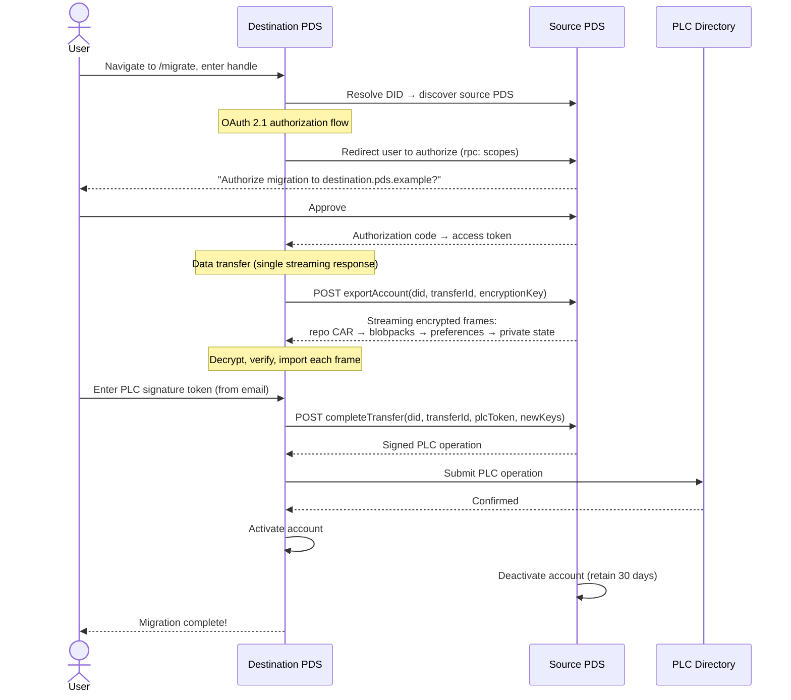

0014: PDS-to-PDS Repository Migration
=====================================

## Summary

This proposal introduces a destination-initiated, encrypted account transfer protocol for AT Protocol. A user navigates to the destination PDS's migration web UI, authorizes access to their source PDS via OAuth, and the destination PDS pulls all account data in a single streaming HTTP response encrypted with HPKE. Three new XRPC endpoints (`exportAccount`, `completeTransfer`, `getTransferStatus`) and a `/.well-known/atproto-transfer` discovery document replace the current client-orchestrated migration model with a direct, encrypted PDS-to-PDS transfer.

## Motivation

Account (repo) portability is fundamental for the decentralized architecture of AT Protocol and conforms to the AT Protocol [ethos][atproto-ethos].

The current migration architecture, while functional, has a less than desirable user experience.

### Current Migration Flow

Today, account migration is a **client-orchestrated, multi-step process** requiring 14+ individual XRPC calls across two PDS instances and the PLC directory. The flow proceeds through four phases:

1. **Account creation**: The client obtains a service auth JWT from the old PDS (`com.atproto.server.getServiceAuth`), then creates a deactivated account on the new PDS (`com.atproto.server.createAccount`) using its existing DID.

2. **Data transfer**: The client downloads the full repository as a CAR file (`com.atproto.sync.getRepo`), uploads it to the new PDS (`com.atproto.repo.importRepo`), then enumerates all blobs (`com.atproto.sync.listBlobs` / `com.atproto.repo.listMissingBlobs`) and re-uploads them one at a time (`com.atproto.sync.getBlob` → `com.atproto.repo.uploadBlob`).

3. **Identity update**: The client requests a PLC operation signature token via email (`com.atproto.identity.requestPlcOperationSignature`), constructs and signs a PLC operation to update the DID document (`com.atproto.identity.signPlcOperation`), and submits it to the new PDS (`com.atproto.identity.submitPlcOperation`).

4. **Activation**: The client activates the new account (`com.atproto.server.activateAccount`) and deactivates the old one (`com.atproto.server.deactivateAccount`).

This flow is implemented by two tools today: the `goat` CLI (maintained by Bluesky) and PDS Moover (a community web application by Bailey Townsend). Both suffer from the same structural limitations.

### Documented Pain Points

**Sequential blob transfer is the primary bottleneck.** Repo migrators today require a user to download every blob from the old PDS and reupload to the new PDS individually. The Bluesky PDS `uploadBlob` implementation enforces a rate limit of [1,000 uploads per day][uploadblob-rate-limit], making large migrations impossible within a single session.

**No resume capability.** If the transfer fails mid-process (network timeout, PDS restart, blob upload error), there is no standardized way to resume.

**Blob size limits cause silent failures.** PDS servers may have maximum blob upload limits that may make migration from one server to another difficult if a repo has a very large blob (e.g. video). For the Bluesky PDS implementation, [PR #4202][pr-4202] proposes making `uploadBlob` rate limits configurable (2,500/hour vs the current 1,000/day), but this doesn't address the overall issues of the migration experience in AT Protocol today.

**PLC tokens expire under time pressure.** The email-delivered PLC operation signature token expires within a specified TTL, creating urgency during what is already a stressful, multi-step process.

### Why PDS-to-PDS?

A direct PDS-to-PDS transfer addresses all of these issues:

- **Improves UX**: The user navigates to the destination PDS, confirms via OAuth, and waits — no CLI tools, no manual blob management, no keeping a browser tab open.
- **Eliminates the client bottleneck**: Data moves directly between servers over datacenter-grade connections rather than through the user's device and network.
- **Enables streaming**: The destination PDS pulls all account data in a single streaming response — repository, blobs, preferences, and private state.
- **Provides application-layer encryption**: HPKE encryption ensures confidentiality of account data independent of transport security, protecting against TLS-terminating intermediaries (CDNs, reverse proxies, load balancers).

### Why HPKE?

HPKE ([RFC 9180][rfc-9180]) is the IETF's modern standard for hybrid public-key encryption, already deployed in TLS Encrypted Client Hello, Oblivious HTTP ([RFC 9540][rfc-9540]), and MLS ([RFC 9420][rfc-9420]).

Key advantages with HPKE base mode:

- **Sender forward secrecy**: Every encryption operation generates a fresh ephemeral key. Compromise of the sender's long-term state does not compromise past transfers.
- **Defense-in-depth**: Data is encrypted to the destination PDS's public key before leaving the source PDS, so TLS-terminating intermediaries cannot observe account data.
- **Algorithm agility**: The JOSE-HPKE framework supports algorithm negotiation, enabling future migration to post-quantum hybrid suites without structural changes.

## Specification

The following sequence diagram illustrates the happy-path destination-initiated transfer flow:



### 1. Well-Known Endpoint: `/.well-known/atproto-transfer`

Each PDS that supports receiving inbound account transfers MUST serve a JSON document at `/.well-known/atproto-transfer` per [RFC 8615][rfc-8615]. This endpoint is unauthenticated and publicly accessible.

#### 1.1 Response Format

```json
{
  "version": 1,
  "did": "did:web:pds.example.com",
  "algorithms": ["HPKE-3", "HPKE-4"],
  "keys": {
    "keys": [
      {
        "kty": "OKP",
        "crv": "X25519",
        "x": "base64url-encoded-public-key",
        "kid": "01KKQNKCFPEPD6MWJ7AZKRWFZ9",
        "alg": "HPKE-3",
        "use": "enc",
        "exp": 1743465600
      }
    ]
  }
}
```

#### 1.2 Field Definitions

| Field | Type | Required | Description |
|---|---|---|---|
| `version` | integer | Yes | Schema version. Currently `1`. |
| `did` | string | Yes | The DID of the PDS service (e.g., `did:web:pds.example.com`). Used to verify identity during transfer. See [Proposal 0010][proposal-0010] for guidance on PDS service DIDs. |
| `algorithms` | string[] | Yes | Ordered list of supported [JOSE-HPKE][jose-hpke] algorithm identifiers, in preference order. See Section 1.3. |
| `keys` | JWK Set | Yes | A JWK Set containing one or more encryption public keys. Each key MUST include `kid`, `alg`, `use` (always `"enc"`), and SHOULD include `exp` (Unix timestamp). |

#### 1.3 Algorithm Requirements

PDS implementations MUST support at least one of the following algorithm suites:

| Identifier | KEM | KDF | AEAD | JWK kty/crv | Nk (key) | Nn (nonce) |
|---|---|---|---|---|---|---|
| `HPKE-3` | DHKEM(X25519, HKDF-SHA256) | HKDF-SHA256 | AES-128-GCM | OKP / X25519 | 16 bytes | 12 bytes |
| `HPKE-4` | DHKEM(X25519, HKDF-SHA256) | HKDF-SHA256 | ChaCha20Poly1305 | OKP / X25519 | 32 bytes | 12 bytes |

`HPKE-3` is RECOMMENDED as the primary algorithm. `HPKE-4` SHOULD be supported as a fallback for environments without AES hardware acceleration. Both provide 128-bit security.

Additional algorithms from the JOSE-HPKE registry MAY be advertised for forward compatibility, including future post-quantum hybrid suites.

> **Note:** The `HPKE-3` and `HPKE-4` identifiers are provisional. Final identifiers will be assigned by the JOSE-HPKE registry upon publication of `draft-ietf-jose-hpke-encrypt` as an RFC. Implementations SHOULD support both provisional and eventual registered identifiers during the transition period.

#### 1.4 Key Lifecycle

Keys published at the well-known endpoint are long-lived (weeks to months) but MUST be rotated periodically:

- PDS implementations SHOULD rotate HPKE keys at least every 90 days.
- During rotation, publish both old and new keys (with distinct `kid` values) to allow in-flight transfers to complete.
- Remove expired keys after a grace period (RECOMMENDED: 7 days after `exp`).
- Key rotation MUST NOT invalidate active transfer sessions that are using a key that was valid at session creation time.

#### 1.5 Caching

Clients SHOULD cache the well-known document for no more than 1 hour. The PDS SHOULD serve `Cache-Control: public, max-age=3600` headers.

### 2. Transfer Protocol

The transfer protocol uses a **destination-initiated pull model**: the destination PDS authenticates to the source PDS via OAuth and pulls account data in a single streaming response.

#### 2.1 `com.atproto.transfer.exportAccount`

Called by the destination PDS on the source PDS. Streams the entire account as HPKE-encrypted frames.

**Request:**

```
POST /xrpc/com.atproto.transfer.exportAccount
Authorization: DPoP <access-token>
DPoP: <dpop-proof-jwt>
Content-Type: application/json

{
  "did": "did:plc:abc123",
  "transferId": "019537a1-7e28-7def-8c56-3a8b69e2d471",
  "algorithm": "HPKE-3",
  "encryptionKey": {
    "kty": "OKP",
    "crv": "X25519",
    "x": "<base64url-destination-public-key>",
    "kid": "transfer-key-2026-03",
    "alg": "HPKE-3",
    "use": "enc"
  }
}
```

| Field | Type | Required | Description |
|---|---|---|---|
| `did` | string | Yes | The DID of the account to export. |
| `transferId` | string | Yes | UUIDv7 generated by the destination PDS ([RFC 9562][rfc-9562]). |
| `algorithm` | string | Yes | The HPKE algorithm suite to use (from the destination's well-known endpoint). |
| `encryptionKey` | JWK | Yes | The destination PDS's HPKE public key for encrypting the response. |

**Response:**

```
HTTP/1.1 200 OK
Content-Type: application/octet-stream
Atproto-Transfer-Enc: <base64url-encapsulated-key>
Atproto-Transfer-Algorithm: HPKE-3

[streaming encrypted frames]
```

The response body is a sequence of encrypted frames (Section 2.5) containing, in order:

1. Repository CAR (`application/vnd.ipld.car`)
2. One or more blobpacks (`application/vnd.atproto.transfer.blobpack`) — custom binary format for streaming multiple blobs; see Addendum
3. Preferences (`application/vnd.atproto.preferences+json`) — user preferences as a JSON array of `app.bsky.actor.defs#preferences` objects
4. Private account state (`application/vnd.atproto.transfer.account-state+cbor`) — CBOR map of private account fields (email, invite codes, etc.); see Section 2.9

The source PDS MUST include all content types it has data for. Empty content types (e.g., no blobs) MAY be omitted. The source PDS MUST include all blobs whose CIDs are referenced by committed records in the exported CAR. Blobs present in the source's blob store but not referenced by any committed record (e.g., orphaned uploads) MAY be included. The source PDS SHOULD also trigger a PLC operation signature token email during this call (equivalent to calling `com.atproto.identity.requestPlcOperationSignature`).

**Authorization:** Requires `rpc:com.atproto.transfer.exportAccount` scope (Section 3.3). The source PDS MUST verify that the OAuth token's `sub` claim matches the requested `did`.

#### 2.2 `com.atproto.transfer.completeTransfer`

Called by the destination PDS on the source PDS after data import is complete. The source PDS signs a PLC operation transferring identity to the destination.

**Request:**

```
POST /xrpc/com.atproto.transfer.completeTransfer
Authorization: DPoP <access-token>
DPoP: <dpop-proof-jwt>
Content-Type: application/json

{
  "did": "did:plc:abc123",
  "transferId": "019537a1-7e28-7def-8c56-3a8b69e2d471",
  "plcSignatureToken": "<email-delivered-token>",
  "newPdsEndpoint": "https://destination.pds.example",
  "newSigningKey": "did:key:zQ3sh...",
  "newRotationKeys": ["did:key:zQ3sh..."]
}
```

| Field | Type | Required | Description |
|---|---|---|---|
| `did` | string | Yes | The DID of the migrating account. |
| `transferId` | string | Yes | Must match the `transferId` from `exportAccount`. |
| `plcSignatureToken` | string | Yes | Email-delivered PLC operation signature token. |
| `newPdsEndpoint` | string | Yes | The destination PDS's service endpoint URL. |
| `newSigningKey` | string | Yes | The destination PDS's signing key (`did:key` format). |
| `newRotationKeys` | string[] | Yes | Rotation keys for the updated DID document. |

**Response:**

```json
{
  "signedPlcOperation": { ... }
}
```

The source PDS constructs and signs a PLC operation that updates the DID document to point to the destination PDS, then deactivates the account locally (retaining data per Section 2.8). The destination PDS submits the signed PLC operation to the PLC directory.

**Authorization:** Requires `rpc:com.atproto.transfer.completeTransfer` scope. The source PDS MUST verify the `plcSignatureToken` and that the `transferId` corresponds to a completed `exportAccount` call.

#### 2.3 `com.atproto.transfer.getTransferStatus`

Optional polling endpoint available on either PDS.

**Request:**

```
GET /xrpc/com.atproto.transfer.getTransferStatus?transferId=019537a1-7e28-7def-8c56-3a8b69e2d471
Authorization: DPoP <access-token>
DPoP: <dpop-proof-jwt>
```

**Response:**

```json
{
  "transferId": "019537a1-7e28-7def-8c56-3a8b69e2d471",
  "did": "did:plc:abc123",
  "status": "exporting",
  "progress": {
    "framesReceived": 12,
    "bytesReceived": 104857600
  }
}
```

Status values: `pending`, `exporting`, `importing`, `completing`, `completed`, `failed`.

#### 2.4 Encryption

Each transfer session uses HPKE encryption with per-frame key derivation.

1. The source PDS generates an ephemeral keypair and calls `SetupBaseS(receiver_pk, info)` where:

   ```
   info = "atproto-transfer-v1"
   ```

2. The source PDS returns the encapsulated key (`enc`) in the `Atproto-Transfer-Enc` response header.

3. Both sides derive the `transfer_secret` using the HPKE Export mechanism ([RFC 9180 Section 5.3][rfc-9180]):

   ```
   transfer_secret = context.Export(exporter_context, L)
   ```

   where:

   ```
   exporter_context = concat(
     "atproto-transfer-v1",   // protocol identifier
     0x00,                     // separator
     utf8(did),                // migrating account DID
     0x00,                     // separator
     utf8(transfer_id)         // from exportAccount request
   )

   L = 32                      // 256 bits
   ```

   The `transfer_secret` is a pseudorandom key (PRK) suitable for direct use with HKDF-Expand ([RFC 5869][rfc-5869]).

4. For each frame, a per-frame symmetric key and nonce are derived:

   ```
   frame_key = HKDF-Expand(
     transfer_secret,
     concat("atproto-frame-key", 0x00, uint32_be(frame_number)),
     Nk
   )
   frame_nonce = HKDF-Expand(
     transfer_secret,
     concat("atproto-frame-nonce", 0x00, uint32_be(frame_number)),
     Nn
   )
   ```

   where Nk and Nn are determined by the negotiated AEAD algorithm (Section 1.3).

5. Each frame is encrypted using the AEAD algorithm with the derived key, nonce, and Additional Authenticated Data (AAD):

   ```
   aad = concat(
     utf8("atproto-transfer-v1"),
     0x00,
     utf8(did),
     0x00,
     utf8(transfer_id),
     0x00,
     uint32_be(frame_number),
     0x00,
     utf8(content_type)
   )
   ```

   The AAD binding prevents frame reordering, type confusion, cross-session replay, and cross-account substitution.

6. The destination PDS calls `SetupBaseR(enc, receiver_sk, info)` to derive the same context and `transfer_secret`, then decrypts each frame independently.

**Nonce uniqueness:** Each frame derives a unique `(key, nonce)` pair from its frame number. Implementations MUST NOT encrypt two payloads with the same frame number within a transfer session. Implementations MUST NOT reuse `transfer_secret` across sessions.

> **Extensibility note:** Per-frame key derivation is naturally extensible to parallel upload in a future protocol version. Because each frame is independently encrypted, frames could be uploaded via separate HTTP requests without requiring sequential nonce management.

#### 2.5 Stream Frame Format

The encrypted response body consists of sequential frames. Each frame is prefixed with a header:

```
[4 bytes: frame_number (uint32, big-endian)]
[4 bytes: content_type_length (uint32, big-endian)]
[N bytes: content_type (UTF-8 string)]
[4 bytes: ciphertext_length (uint32, big-endian)]
[M bytes: ciphertext (AEAD ciphertext + authentication tag)]
```

Frames are numbered sequentially starting from 0. The receiver reads frames in order until the HTTP response stream ends. If the stream ends mid-frame, the transfer has failed and SHOULD be retried from scratch.

**Verification per frame type:**

- **Repository CAR**: Validate the Merkle tree structure and signed commit.
- **Blobpack**: Verify each blob's CID against its content (see Addendum).
- **Post-import blob reconciliation**: After all frames are processed, the destination SHOULD
  call `com.atproto.repo.listMissingBlobs` against its own store to confirm that every blob
  CID referenced in the imported CAR is present. Any deficit SHOULD be recovered by fetching
  missing blobs from the source via `com.atproto.sync.getBlob` (authorized by the
  `rpc:com.atproto.sync.getBlob` scope in the migration access token) before calling
  `completeTransfer`. Blobs received in blobpack frames whose CIDs do not appear in any
  imported record MAY be stored or discarded at the destination's discretion.
- **Preferences**: Validate JSON schema conformance.
- **Private state**: Validate CBOR structure against Section 2.9.

#### 2.6 Error Handling

| Error Code | HTTP | Description |
|---|---|---|
| `AccountNotFound` | 404 | The requested DID is not hosted on this PDS. |
| `TransferNotAuthorized` | 403 | OAuth token missing, invalid, or insufficient scope. |
| `TransferAlreadyActive` | 409 | A transfer is already in progress for this DID. |
| `TransferNotFound` | 404 | The `transferId` does not match any known transfer. |
| `InvalidPlcToken` | 400 | The PLC signature token is invalid or expired. |
| `AccountDeactivated` | 400 | The account has already been deactivated. |
| `ExportFailed` | 500 | Internal error during data export. |

All error responses use the standard XRPC error format:

```json
{
  "error": "TransferNotAuthorized",
  "message": "OAuth token is missing required rpc: scope for this endpoint"
}
```

#### 2.7 Transport Requirements

All transfer communication MUST use HTTPS with TLS 1.3 ([RFC 8446][rfc-8446]) or TLS 1.2. Implementations MUST follow [RFC 9325][rfc-9325] for secure TLS configuration. TLS early data (0-RTT) MUST NOT be used for `exportAccount` or `completeTransfer` requests due to replay risks.

#### 2.8 Private State Schema

The `application/vnd.atproto.transfer.account-state+cbor` content type carries implementation-specific private data. To enable cross-implementation transfers, this section defines a minimum common schema that all implementations SHOULD support.

**Common fields (RECOMMENDED):**

| CBOR Key | Type | Description |
|---|---|---|
| `email` | text string | Account email address |
| `emailConfirmed` | boolean | Whether the email has been verified |
| `inviteCodes` | array of text strings | Unused invite codes |

**Implementation-specific fields (OPTIONAL):**

| CBOR Key | Type | Description |
|---|---|---|
| `appPasswords` | array of maps | Hashed application passwords (hash algorithm is implementation-specific) |
| `notificationRouting` | map | Notification delivery configuration |
| `mutedWords` | array of text strings | User's muted word list |
| `pinnedFeeds` | array of text strings | AT URIs of pinned feed generators |

Implementations SHOULD include all common fields and MAY include additional implementation-specific fields. The destination PDS MUST silently ignore fields it does not recognize. The destination PDS MUST import all recognized common fields.

> **Note:** A full private state schema standardization is deferred to future work. This minimum schema enables the most critical data (email address, invite codes) to survive cross-implementation transfers. App passwords may not be portable between different PDS implementations due to differing hash algorithms; users SHOULD be warned that app passwords may need to be regenerated after migration.

### 3. Web UI Flow (OAuth 2.1)

PDS implementations SHOULD serve a web-based migration interface that allows users to initiate transfers without CLI tools.

#### 3.1 Authorization Model

The destination PDS acts as an OAuth 2.1 client to the source PDS. The user authorizes the destination PDS to export their account data and complete the identity transfer. This follows the same OAuth framework defined in [Proposal 0004][proposal-0004].

The destination PDS publishes OAuth client metadata at:

```
https://destination.pds.example/.well-known/oauth-client-metadata/migration
```

```json
{
  "client_id": "https://destination.pds.example/.well-known/oauth-client-metadata/migration",
  "client_name": "PDS Account Migration — destination.pds.example",
  "grant_types": ["authorization_code"],
  "response_types": ["code"],
  "scope": "rpc:com.atproto.transfer.exportAccount rpc:com.atproto.transfer.completeTransfer rpc:com.atproto.transfer.getTransferStatus rpc:com.atproto.sync.getBlob",
  "redirect_uris": ["https://destination.pds.example/migrate/callback"],
  "token_endpoint_auth_method": "none",
  "dpop_bound_access_tokens": true,
  "application_type": "web",
  "require_pushed_authorization_requests": true
}
```

#### 3.2 User Flow (Destination-Initiated)

1. **User navigates** to `https://destination.pds.example/migrate`.

2. **User enters** their handle (e.g., `alice.bsky.social`) or DID.

3. **Destination resolves identity:**
   - Fetches `https://alice.bsky.social/.well-known/atproto-did` → `did:plc:abc123`
   - Fetches `https://plc.directory/did:plc:abc123` → DID document → source PDS endpoint

4. **Destination fetches source OAuth metadata:**
   - `GET https://source.pds.example/.well-known/oauth-authorization-server`

5. **Destination pushes authorization request** to the source PDS PAR endpoint (the atproto OAuth spec requires PAR; see [the OAuth spec][oauth-spec]):
   ```
   POST https://source.pds.example/oauth/par
   Content-Type: application/x-www-form-urlencoded

   response_type=code&
   client_id=https://destination.pds.example/.well-known/oauth-client-metadata/migration&
   redirect_uri=https://destination.pds.example/migrate/callback&
   scope=rpc:com.atproto.transfer.exportAccount%20rpc:com.atproto.transfer.completeTransfer%20rpc:com.atproto.transfer.getTransferStatus%20rpc:com.atproto.sync.getBlob&
   state=<csrf-token>&
   code_challenge=<S256-challenge>&
   code_challenge_method=S256&
   login_hint=did:plc:abc123
   ```

   Response: `{ "request_uri": "urn:ietf:params:oauth:request_uri:<token>", "expires_in": 60 }`

   **Destination redirects user** to the source PDS authorization endpoint using the `request_uri`:
   ```
   https://source.pds.example/oauth/authorize?
     client_id=https://destination.pds.example/.well-known/oauth-client-metadata/migration&
     request_uri=urn:ietf:params:oauth:request_uri:<token>
   ```

   Implementations MUST use PAR. Plain authorization redirects with inline parameters MUST NOT be used.

6. **User authenticates** on the source PDS: "Authorize migration of your account to destination.pds.example?"

7. **Source PDS redirects back** with authorization code:
   ```
   https://destination.pds.example/migrate/callback?code=<code>&state=<csrf-token>
   ```

8. **Destination exchanges code** for access token:
   ```
   POST https://source.pds.example/oauth/token
   DPoP: <dpop-proof-jwt>
   Content-Type: application/x-www-form-urlencoded

   grant_type=authorization_code&
   code=<authorization-code>&
   redirect_uri=https://destination.pds.example/migrate/callback&
   client_id=https://destination.pds.example/.well-known/oauth-client-metadata/migration&
   code_verifier=<pkce-verifier>
   ```

   Response: `{ "access_token": "...", "token_type": "DPoP", "scope": "rpc:com.atproto.transfer.exportAccount rpc:com.atproto.transfer.completeTransfer rpc:com.atproto.transfer.getTransferStatus rpc:com.atproto.sync.getBlob", "sub": "did:plc:abc123" }`

9. **Destination generates** a UUIDv7 transfer ID and creates a deactivated account for the DID.

10. **Destination calls** `exportAccount` on the source PDS (Section 2.1).

11. **Destination decrypts, verifies, and imports** each frame as it arrives.

12. **User enters PLC signature token** (received via email during step 10).

13. **Destination calls** `completeTransfer` on the source PDS (Section 2.2).

14. **Destination submits** the signed PLC operation to the PLC directory.

15. **Destination activates** the account. Source PDS deactivates and retains data per Section 2.8.

16. **Migration complete.** "Your account has been migrated to destination.pds.example!"

#### 3.3 OAuth Scopes

This proposal uses the granular `rpc:` scope system defined in [Proposal 0011][proposal-0011]. The destination PDS requests the following four scopes during the OAuth flow:

- `rpc:com.atproto.transfer.exportAccount` — call the export endpoint on the source PDS
- `rpc:com.atproto.transfer.completeTransfer` — call the complete endpoint on the source PDS
- `rpc:com.atproto.transfer.getTransferStatus` — call the status endpoint on the source PDS
- `rpc:com.atproto.sync.getBlob` — fetch individual blobs from the source PDS during the active transfer window for post-import blob recovery (Section 2.5)

No `transition:*` scope is defined by this proposal. Implementations MUST support `rpc:` scope validation to implement this proposal. Source PDS instances that do not yet support `rpc:` scope validation cannot serve as migration sources.

#### 3.4 Pre-Migration Checklist

The migration web UI SHOULD present a pre-migration checklist before proceeding:

- [ ] **Rotation key check**: Verify the user's DID document rotation key configuration. Warn if the user has no self-controlled rotation key, or if the PDS's rotation key has higher priority.
- [ ] **Backup recommendation**: Strongly recommend the user create a local backup via `com.atproto.sync.getRepo` before proceeding. The UI SHOULD offer a one-click backup download.
- [ ] **Destination verification**: Display the destination PDS hostname, its DID, and HPKE encryption support.
- [ ] **Private state warning**: If applicable, warn that email settings, app passwords, and notification preferences may need manual reconfiguration.
- [ ] **Social graph reassurance**: Explain that followers, likes, blocks, and mutes are stored on other users' PDS instances and linked by DID, not PDS hostname.
- [ ] **72-hour monitoring period**: Explain the PLC rollback window and that the destination PDS will monitor for unauthorized rollback attempts.

## Security Considerations

### Threat Model

The transfer protocol assumes:

- Both PDS instances are honest-but-curious: they will follow the protocol but may attempt to learn information beyond what is necessary.
- The network between PDSes is untrusted (despite TLS).
- The user's device is trusted for authorization decisions but not required as a data intermediary.
- TLS-terminating intermediaries (CDNs, reverse proxies, load balancers) are untrusted for data confidentiality — the primary justification for application-layer HPKE encryption.

### Forward Secrecy

HPKE's base mode provides **sender forward secrecy**: each transfer generates a fresh ephemeral keypair, discarded after the HPKE context is established. However, base mode does **not** provide full forward secrecy with respect to the receiver's long-term key. An attacker who compromises the receiver's long-term private key **and** has recorded the encapsulated key and ciphertext can decrypt past transfers.

This is an accepted trade-off. Full forward secrecy would require an interactive key exchange, adding round trips and complexity. The threat is mitigated by regular key rotation (Section 1.4), the requirement to record ciphertext at transfer time, and TLS 1.3 transport-layer forward secrecy.

### Replay Protection

The AAD binding of `did`, `transfer_id`, `frame_number`, and `content_type` prevents:

- **Cross-session replay**: Frames from one transfer cannot be replayed into another.
- **Cross-account replay**: Frames for one DID cannot be substituted for another.
- **Reordering**: Frame sequence is authenticated.
- **Type confusion**: A repo frame cannot be substituted for a blob frame.

### Denial of Service

The following mitigations SHOULD be implemented:

- Destination PDSes SHOULD limit concurrent inbound transfers (RECOMMENDED: max 5 per worker, max 2 from the same source PDS).
- Transfer sessions exceeding 24 hours without progress SHOULD be automatically cancelled.
- Rate limiting on `exportAccount`: RECOMMENDED max 10 new transfers per source PDS per hour.
- Total in-flight storage quota: RECOMMENDED 50 GB per worker for all in-progress transfers.

### Adversarial Migration

The protocol above assumes cooperative PDS instances. A hostile source PDS may obstruct migration by refusing to export data, refusing PLC operations, serving corrupted data, or stalling transfers. This section addresses attack vectors documented by [David Buchanan][buchanan-adversarial] and [Bryan Newbold][newbold-recovery-keys].

**Rotation key priority attack.** The `did:plc` method uses ordered rotation keys — index 0 has highest priority. If the PDS holds index 0, it can revert a completed migration within the 72-hour PLC rollback window.

**Mitigations:**

- **Pre-positioned recovery keys.** Users SHOULD hold a rotation key at index 0 before migrating. The pre-migration checklist (Section 3.4) verifies this.
- **Post-migration PLC monitoring.** The destination PDS SHOULD monitor the PLC directory for the migrated DID for 72 hours. If a rollback is detected, alert the user and provide tools to re-submit a PLC operation with their index-0 key.
- **Independent backups.** Users SHOULD maintain backups before migrating. The pre-migration checklist includes a backup recommendation.

**Fallback: client-orchestrated migration.** When the source PDS refuses to cooperate, users can fall back to existing tools ([`goat`][goat-cli], [PDS Moover][pds-moover]) using the current client-orchestrated flow. Repository data can be sourced from the Relay network if the source PDS withholds it. Private state will be lost. The user MUST hold an index-0 rotation key to override the hostile PDS's PLC operations.

## Compatibility

### Backward Compatibility

This proposal is fully additive. No existing XRPC endpoints are modified. PDS instances that do not implement PDS-to-PDS transfer continue to work exactly as they do today. Client-orchestrated migration using `getRepo`, `importRepo`, `uploadBlob`, and the existing identity endpoints remains available as a fallback.

### Rollout Strategy

1. **Phase 1 — Sending support**: PDS implementations add `exportAccount` and `completeTransfer`. Existing PDSes can serve as migration sources.
2. **Phase 2 — Receiving support**: PDS implementations add `/.well-known/atproto-transfer`, migration web UI, and the OAuth client flow.
3. **Phase 3 — Full PDS-to-PDS**: Both sides support the protocol. The migration web UI becomes the primary migration path.

Client-orchestrated migration remains available throughout all phases and indefinitely after.

### Implementation Requirements by PDS

| PDS Role | Required Endpoints | Optional |
|---|---|---|
| Source (sending) | `exportAccount`, `completeTransfer` | `getTransferStatus` |
| Destination (receiving) | `/.well-known/atproto-transfer`, migration web UI, OAuth client | `getTransferStatus` |

### Interaction with Existing Proposals

- **Proposal 0004 (OAuth)**: This proposal builds on the OAuth 2.1 framework. The destination PDS is an OAuth client to the source PDS.
- **Proposal 0010 (DID Service References)**: PDS service DIDs referenced in the well-known endpoint.
- **Proposal 0011 (Auth Scopes)**: This proposal uses Proposal 0011's granular `rpc:` scope system directly, with no `transition:*` scope defined.

## Future Extensions

The following are explicitly deferred to future work:

- **Parallel frame upload**: Per-frame key derivation enables a future version where frames are uploaded via separate HTTP requests for parallelism.
- **Resumable transfers**: A future version could add frame acknowledgment and resumption from the last confirmed frame.
- **Post-quantum algorithms**: The algorithm negotiation framework supports future HPKE suites with post-quantum KEMs.
- **Cross-implementation private state schema**: Standardized private state fields beyond the minimum in Section 2.9.

## Minimum Implementation Profile

A PDS implementing this protocol for the first time need not support every feature. The minimum viable implementation:

**Sending-only (source PDS):**

1. Implement `exportAccount` — stream repo CAR and blobpacks as encrypted frames.
2. Implement `completeTransfer` — sign and return a PLC operation.
3. Support HPKE-3 (AES-128-GCM) encryption.
4. Support `application/vnd.ipld.car` and `application/vnd.atproto.transfer.blobpack` content types.
5. Support for preferences and private state is REQUIRED.

**Receiving-only (destination PDS):**

1. Serve `/.well-known/atproto-transfer` with at least one HPKE key.
2. Implement the OAuth client flow and migration web UI.
3. Decrypt and import repo CAR and blobpack frames.
4. Submit the signed PLC operation to the PLC directory.
5. Support for preferences and private state import is REQUIRED.

## Addendum: Blobpack Wire Format

The `application/vnd.atproto.transfer.blobpack` content type uses a custom binary format for packing multiple blobs into a single encrypted frame. All multi-byte integers are unsigned and encoded in network byte order (big-endian).

### Wire Format

```
[4 bytes: magic number 0x41545042 ("ATPB")]
[1 byte:  version (0x01)]
--- per entry (repeated until end of plaintext) ---
[4 bytes: CID length (uint32)]
[N bytes: CID (binary-encoded CID: varint version, varint codec, multihash)]
[8 bytes: blob length (uint64)]
[M bytes: blob data]
--- end per entry ---
```

### Header Fields

The **magic number** (`0x41545042`, ASCII "ATPB") allows receivers to detect format mismatches or corrupted streams early. This value is distinct from CAR v1 headers (which begin with a DAG-CBOR length varint) and CAR v2 pragmas (`0x0aa16776`).

The **version** byte identifies the blobpack wire format version. The initial version is `0x01`. Receivers MUST reject blobpacks with an unrecognized version.

### Entry Parsing

Entries are self-delimiting: each entry's total size is `4 + CID_length + 8 + blob_length` bytes. The receiver reads entries sequentially until the decrypted plaintext is exhausted. There is no entry count field; the stream boundary is defined by the AEAD ciphertext envelope.

If the plaintext does not end exactly at an entry boundary, the receiver MUST reject the frame.

### CID Requirements

CIDs in blobpack entries MUST be CID version 1 with the `raw` codec (multicodec `0x55`) and SHA-256 multihash (multicodec `0x12`, 32-byte digest). This matches ATProto's exclusive use of CIDv1/raw/SHA-256 for blob references. Receivers MUST reject entries with any other CID version, codec, or hash algorithm.

The **CID length** field is uint32. In practice, conforming CIDs are exactly 36 bytes. Receivers SHOULD reject entries where `CID_length` exceeds 512 bytes as a defense against malformed streams.

### Blob Length

The **blob length** field is a uint64 to accommodate large media blobs (e.g., video files exceeding 4 GB). Receivers SHOULD reject entries where `blob_length` exceeds the receiver's configured per-blob size limit. A `blob_length` of 0 is syntactically valid but receivers MAY reject zero-length blobs per policy.

### Integrity Verification

Receivers MUST verify each blob's CID incrementally: compute the SHA-256 hash of the blob data, construct the expected CIDv1/raw/SHA-256, and compare it to the declared CID. If any entry fails verification, the receiver MUST reject the entire frame.

### Duplicate CIDs

If the same CID appears multiple times within a single blobpack, the receiver MUST verify each occurrence independently but MAY store only the first successfully verified copy.

### Design Rationale: Blobpack vs. CAR v2

The blobpack format is a purpose-built streaming format for blob transfer. CAR v2 was considered but rejected:

1. **Access pattern mismatch.** CAR v2 is designed for random-access reads; blob transfer is write-once streaming ingest.
2. **No DAG structure.** Blobs have no internal IPLD structure. CAR v2 would require a synthetic root node.
3. **Implementation simplicity.** Blobpack requires ~50 lines of code. CAR v2 requires a full parser plus index handling.
4. **Library availability.** CAR v2 support varies across ecosystems.

CAR v1 remains the correct format for repository data where DAG structure and Merkle root verification are essential.

### Content Type: `application/vnd.atproto.preferences+json`

A JSON document conforming to the `app.bsky.actor.defs#preferences` lexicon schema. Contains the user's application preferences as a JSON array of preference objects.

### Content Type: `application/vnd.atproto.transfer.account-state+cbor`

A CBOR-encoded map containing private account state fields. See Section 2.9 for the minimum common schema. The `+cbor` structured suffix is registered with IANA ([RFC 8949 Section 9.5][rfc-8949]).

## Acknowledgments

This proposal draws on community contributions across cryptography, data formats, implementation feasibility, OAuth design, and user experience. Special thanks to the working group participants.

Prior art and community tools that informed this design:

- [`goat` CLI][goat-cli] — Official ATProto CLI with migration support
- [PDS Moover][pds-moover] — Community migration web application by Bailey Townsend
- [David Buchanan][buchanan-adversarial] — Adversarial PDS migration analysis
- [Bryan Newbold][newbold-recovery-keys] — Identity recovery key strategies

## References

### Normative References

- [RFC 9180][rfc-9180] — Hybrid Public Key Encryption (HPKE)
- [RFC 5869][rfc-5869] — HMAC-based Extract-and-Expand Key Derivation Function (HKDF)
- [RFC 9562][rfc-9562] — Universally Unique Identifiers (UUIDs)
- [draft-ietf-jose-hpke-encrypt][jose-hpke] — Use of HPKE with JOSE
- [RFC 8615][rfc-8615] — Well-Known Uniform Resource Identifiers (URIs)
- [RFC 8446][rfc-8446] — The Transport Layer Security (TLS) Protocol Version 1.3
- [RFC 9325][rfc-9325] — Recommendations for Secure Use of TLS and DTLS
- [ATProto DID Specification][atproto-did] — DID method, rotation key semantics
- [ATProto Repository Specification][atproto-repo] — Repository structure, CAR format
- [ATProto HTTP API (XRPC) Specification][atproto-xrpc] — XRPC endpoint conventions

### Informative References

- [ATProto OAuth Specification][oauth-spec] — Pushed Authorization Requests (PAR) requirement
- [Proposal 0004: OAuth][proposal-0004] — OAuth 2.1 framework for ATProto
- [Proposal 0010: DID Service References][proposal-0010] — DID document service references
- [Proposal 0011: Auth Scopes][proposal-0011] — Permission scopes for ATProto OAuth
- [PDS Moover][pds-moover] — Community migration tool by Bailey Townsend
- [`goat` CLI][goat-cli] — Official ATProto CLI with migration support
- [David Buchanan, "Adversarial ATProto PDS Migration"][buchanan-adversarial]
- [Bryan Newbold, "Identity Recovery Keys"][newbold-recovery-keys]
- [PR #4202: uploadBlob rate limit adjustment][pr-4202]
- [RFC 9540][rfc-9540] — Oblivious HTTP (HPKE deployment precedent)
- [RFC 9420][rfc-9420] — Messaging Layer Security (HPKE deployment precedent)
- [RFC 8949][rfc-8949] — Concise Binary Object Representation (CBOR)

<!-- Reference Links -->
[rfc-9180]: https://datatracker.ietf.org/doc/rfc9180/
[rfc-5869]: https://datatracker.ietf.org/doc/rfc5869/
[rfc-9562]: https://datatracker.ietf.org/doc/rfc9562/
[rfc-8615]: https://www.rfc-editor.org/rfc/rfc8615.html
[rfc-8446]: https://datatracker.ietf.org/doc/rfc8446/
[rfc-9325]: https://datatracker.ietf.org/doc/rfc9325/
[rfc-9540]: https://datatracker.ietf.org/doc/rfc9540/
[rfc-9420]: https://datatracker.ietf.org/doc/rfc9420/
[rfc-8949]: https://datatracker.ietf.org/doc/rfc8949/
[jose-hpke]: https://datatracker.ietf.org/doc/draft-ietf-jose-hpke-encrypt/
[atproto-ethos]: https://atproto.com/articles/atproto-ethos
[atproto-did]: https://atproto.com/specs/did
[atproto-repo]: https://atproto.com/specs/repository
[atproto-xrpc]: https://atproto.com/specs/xrpc
[oauth-spec]: https://atproto.com/specs/oauth
[proposal-0004]: https://github.com/bluesky-social/proposals/tree/main/0004-oauth
[proposal-0010]: https://github.com/bluesky-social/proposals/tree/main/0010-did-service-references
[proposal-0011]: https://github.com/bluesky-social/proposals/tree/main/0011-auth-scopes
[pds-moover]: https://pdsmoover.com/
[goat-cli]: https://github.com/bluesky-social/goat
[buchanan-adversarial]: https://bsky.bad-example.com/adversarial-atproto-pds-migration
[newbold-recovery-keys]: https://whtwnd.com/bnewbold.net/entries/Identity%20Recovery%20Keys
[pr-4202]: https://github.com/bluesky-social/atproto/pull/4202
[uploadblob-rate-limit]: https://github.com/bluesky-social/atproto/blob/main/packages/pds/src/api/com/atproto/repo/uploadBlob.ts
